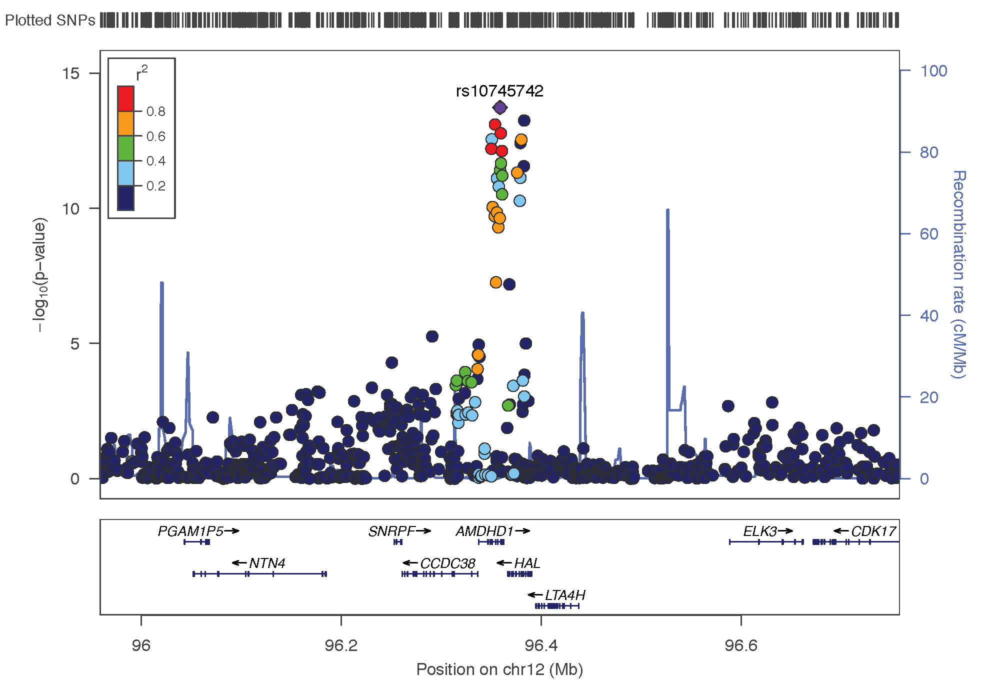
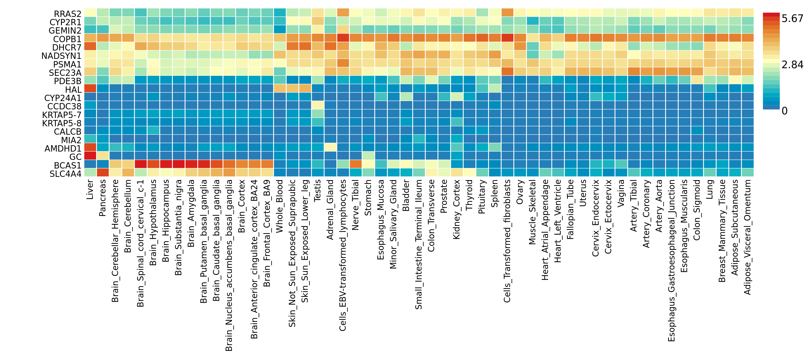

<hr>

*Yan Holtz, Zhihong Zhu, Julanne Frater, Perry Bartlett, Jian Yang, John McGrath*

<hr>

<br><br>

The previous part of this project run a GWAS on vitamin D blood concentration and found out 6 loci significantly associated. This part aims to annotate these regions in order to list putative underlying genes.

```{r, warning=FALSE, message=FALSE}
library(tidyverse)
library(qqman)
library(readr)
library(DT)
library(RColorBrewer)
library(ggrepel)
```


#Genes in the region {.tabset .tabset-fade}
***

The [Locus Zoom](http://locuszoom.org/genform.php?type=yourdata) online tool allows to visualise the regions of interest and see the underlying genes. Just put the `.linear` result of PLINK on it, and specify the SNP of interest.

Results for the 6 significant associations:

- **rs3755967**:  chromosome 4 ~ 73Mb | gene: GC | [Genome Browser](https://genome.ucsc.edu/cgi-bin/hgTracks?db=hg38&lastVirtModeType=default&lastVirtModeExtraState=&virtModeType=default&virtMode=0&nonVirtPosition=&position=chr4%3A71004093%2D72598593&hgsid=657472259_IeGzteVrW0qsItpQqUuZeaBnnFoc) | Role = Vitamin D transport.
- **rs12785878**: chromosome 11 ~ 79Mb | gene: NADSYN1 / DHCR7 | [Genome Browser](https://genome.ucsc.edu/cgi-bin/hgTracks?db=hg38&lastVirtModeType=default&lastVirtModeExtraState=&virtModeType=default&virtMode=0&nonVirtPosition=&position=chr11%3A71456153%2D71456652&hgsid=657472259_IeGzteVrW0qsItpQqUuZeaBnnFoc)
- **rs10741657**: chromosome 11 ~ 15Mb | gene: CYP2R1| [Genome Browser](https://genome.ucsc.edu/cgi-bin/hgTracks?db=hg38&lastVirtModeType=default&lastVirtModeExtraState=&virtModeType=default&virtMode=0&nonVirtPosition=&position=chr11%3A14888332%2D14898331&hgsid=657472259_IeGzteVrW0qsItpQqUuZeaBnnFoc) | known role = hydroxylation.
- **rs17216707**: chromosome 20 ~ 52Mb | gene: CYP24A1| [Genome Browser](https://genome.ucsc.edu/cgi-bin/hgTracks?db=hg38&lastVirtModeType=default&lastVirtModeExtraState=&virtModeType=default&virtMode=0&nonVirtPosition=&position=chr20%3A51610823%2D56620822&hgsid=657472259_IeGzteVrW0qsItpQqUuZeaBnnFoc) | Role = Catabolism.
- **rs10745742**: chromosome 12 ~ 94Mb | gene: AMDHD1| [Genome Browser](https://genome.ucsc.edu/cgi-bin/hgTracks?db=hg38&lastVirtModeType=default&lastVirtModeExtraState=&virtModeType=default&virtMode=0&nonVirtPosition=&position=chr12%3A95939701%2D95989800&hgsid=657472259_IeGzteVrW0qsItpQqUuZeaBnnFoc)
- **rs8018720**:  chromosome 14 ~ 38Mb | gene: SEC23A| [Genome Browser](https://genome.ucsc.edu/cgi-bin/hgTracks?db=hg38&lastVirtModeType=default&lastVirtModeExtraState=&virtModeType=default&virtMode=0&nonVirtPosition=&position=chr14%3A39086731%2D39087231&hgsid=657472259_IeGzteVrW0qsItpQqUuZeaBnnFoc)


<br><br>

##rs3755967


##rs12785878


##rs10741657


##rs17216707


##rs10745742


##rs8018720


#Genome-Wide Gene-based Association Study (GWGAS)
***

This step is computed using the `MAGMA pipeline` that is run through the [FUMA online platform](http://fuma.ctglab.nl). Here is what it does:

- All SNPs used in the GWAS are mapped to 17999 protein coding genes.
- Aggregate association result of all SNPs in a gene. 
- Deduce the association of the gene.

Here is the Manhattan plot showing the p-value of each gene. Genome wide significance (red dashed line in the plot) was defined at P = 0.05/17999 = 2.778e-6.

<br><br>
<center>

</center>
<br><br>

Number of significantly associated genes: **22**. A list of these 22 genes can be found using the download button of FUMA and reading `genes.txt`. This list of gene is going to be used for several of the following steps.

*Note*: Connection to the [FUMA online platform](http://fuma.ctglab.nl): go to the [website](http://fuma.ctglab.nl) / Account: y.holtz@uq.edu.au / Pass: fumayanholtz.

*Note*: This step is computed with the `SNP2GENE` utility of the FUMA platform.


# Where are these 22 genes expressed?
***

The previous GWGAS step identified 22 genes potentially involved in Vitamin-D concentration. The `Gene2Func` utility of the FUMA platform allows to check where these genes are expressed the most. It uses the `GTEX dataset` that provides expression data for all genes in 53 different tissue types:

<br><br>
<center>

</center>

A few observation:

- The GC gene that is the main target is mainly expressed in liver. It is also a bit expressed in Pancreas and Stomach.
- NADSYN1, PSMA1 and SEC23A have very similar pattern.
- ...


# Differentially expressed genes (DEG)
***
This part follows the previous one. If I understood well here is how it works:

- for each gene, consider its expression in each tissue (heatmap above)
- for each tissue X, determine if its expression in X is significantly different that for all other tissues together.
- see if a tissue tends to have a lot of differentially expressed genes.
- do it for up-regulation and down-regulation as well.

<br><br>
<center>

</center>
<br><br>

A few observation:

- No significantly enriched DEG sets (would be in red otherwise)
- interesting to see this strong p-value for up-regulated DEG genes in liver. It means that a strong proportion of our 22 genes are over expressed in liver.
- intersting to see skin in 3rd position.


# Where are the SNPs more expressed
***

The previous approach considered only the 22 significant genes detected using the GWGAS method. The MAGMA pipeline offers another approach that use the full distribution of SNP p-values to detect tissues enriched for vitamin D concentration. Here is the result:

<br><br>
<center>

</center>

Observation: 

- No significant tissue
- Not really consistent ith previous result on genes expression: liver and kydney are far in the analysis.


#Gene-Set analysis
***

The [MsigDB](http://software.broadinstitute.org/gsea/msigdb/collections.jsp) is a database that lists about 10,000 groups of gene involved in the same pathways. For instance, the pathway called `go_favonoid_metabolic_process` is composed by 24 genes and contols the flavonoid metabolic process.  

It is possible to test wether our 22 genes are often involved in some of these pathways. In our case, no significant pathway seems to be enriched. Here are 4 pathways that seem to have a little trend, but do not pass multiple testing correction.

- Curated_gene_sets:reactome_biological_oxidations
- GO_bp:go_positive_regulation_of_transcription_from_rna_polymerase_ii_promoter_involved_in_cellular_response_to_chemical_stimulus
- GO_bp:go_flavonoid_metabolic_process
- GO_bp:go_cellular_glucuronidation


#Functional annotation of SNPs
***

The vitamin-D GWAS currently available show `6 independant loci`. These loci are composed by `1875 SNPs`. Each SNP has a position. Using the genome annotation, it is possible to count what are the functional annotations of SNPs that are the most frequent. FUMA allows to load a file called `snps.txt` that present these results. Let's load it and visualize the data.

```{r, warning=FALSE, message=FALSE, fig.width=10, fig.height=4}
# Packages
library(tidyverse)
library(hrbrthemes)
library(patchwork)

# read data
data <- read.table("0_DATA/snps.txt", header=T)

# Plot 1: functionnal annotation:
p1 <- data %>%
  filter(!is.na(func)) %>%
  filter(!func %in% c("upstream:downstream:upstream", "upstream:upstream:downstream" )) %>%
  group_by(func) %>%
  summarize(n=n()) %>%
  arrange(n) %>%
  mutate(func=factor(func, func)) %>%
  ggplot(aes(x=func, y=n)) +
    geom_bar(stat="identity", alpha=0.6) +
    coord_flip() +
    theme_ipsum() +
    xlab("") +
    ylab("") +
    ggtitle("Functionnal Annotation") +
    theme(plot.title = element_text(size=10))

# Plot 2: regulome DB score:
p2 <- data %>%
  filter(!is.na(RDB)) %>%
  group_by(RDB) %>%
  summarize(n=n()) %>%
  arrange(desc(RDB)) %>%
  mutate(RDB=factor(RDB,RDB)) %>%
  ggplot(aes(x=RDB, y=n)) +
    geom_bar(stat="identity", alpha=0.6) +
    coord_flip() +
    theme_ipsum() +
    xlab("") +
    ylab("") +
    ggtitle("RegulomeDB score") +
    theme(plot.title = element_text(size=10))

# Plot 3: chromatin state:
p3 <- data %>%
  group_by(minChrState) %>%
  summarize(n=n()) %>%
  arrange(desc(minChrState)) %>%
  mutate(minChrState = factor(minChrState, minChrState)) %>%
  ggplot(aes(x=as.factor(minChrState), y=n)) +
    geom_bar(stat="identity", alpha=0.6) +
    coord_flip() +
    theme_ipsum()  +
    xlab("") +
    ylab("") +
    ggtitle("Chromatine state") +
    theme(plot.title = element_text(size=10))

p1 + p2 + p3
```

<br>

<u>*Explanation*</u>:

- *Functionnal Annotation*: distribution of the functionnal consequences of SNPs in genomic risk loci.
- *RegulomeDB score*: Distribution of RegulomeDB scores for SNPs in genomic risk loci, with a low score indicateing a high likelihood of the SNP having a regulatory function.
- *Chromatin state*: The minimum chromatin state across 127 tissue and cell types for SNPs in genomic risk loci, with lower states indicating higher accessibility and states 1-7 referring to open chromatin states.

<br>


*note* - I'm not sure why this result is interesting. Indeed, we would probably need to compare it with the proportion of each class in the complete genome. For instance, intergenic and intronic annotations are probably the most common ones in the genome, so it is not a surprise if I observe it so often, is it?

*note* - The tool used to assign each SNP to a class is called ANNOVAR.


# Other traits controled by the same loci:
***

The GWAS catalog is a catalog of thounsands of GWAS. FUMA allows to take all our significant SNPs and check if they have already been detected for another study. It appears that:

- *chromosome 4*: Non-alcoholic fatty liver disease histology (other) / Myeloid white cell count / White blood cell count / Granulocyte count / Neutrophil count /  basophil count
- *chromosome 11*: HDL cholesterol / 
- *chromosome 20*: Glomerular filtration rate


# A note on FUMA
***


[FUMA](http://fuma.ctglab.nl) is a platform that can be used to annotate, prioritize, visualize and interpret GWAS results. It offers 2 main functions:  

- The **SNP2GENE** function takes GWAS summary statistics as an input, and provides extensive functional annotation for all SNPs in genomic areas identified by lead SNPs. 
- The **GENE2FUNC** function takes a list of geneids (as identified by SNP2GENE or as provided manually) and annotates genes in biological context 

*Note* - Connection to the [FUMA online platform](http://fuma.ctglab.nl): go to the [website](http://fuma.ctglab.nl) / Account: y.holtz@uq.edu.au / Pass: fumayanholtz.

*Citation* -

*Input* - as input it takes a GWAS result. Transfert the Plink results locally:
```{bash, eval=FALSE}
cd /Users/y.holtz/Desktop
scp y.holtz@delta.imb.uq.edu.au:/home/y.holtz/BLOOD_GWAS/1_GWAS/PLINK/result_GWAS_bloodpressure_plink.linear.gz .
```


  
  
  
  
  
#Other: Genes in the region with IGV
***
Another possiblity suggested by John would be to use the [IGV](http://software.broadinstitute.org/software/igv/) software. Download is possible [here](http://software.broadinstitute.org/software/igv/download). It looks like this tool is more adapted for people working at the molecular level? Like using NGS and reads?


