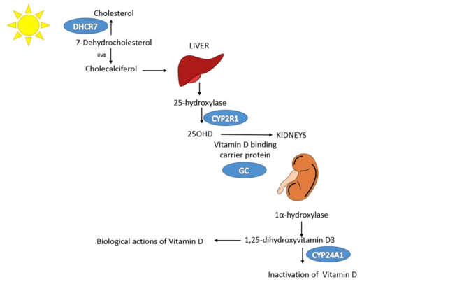

<br><br>
```{r echo=FALSE, warning=FALSE, message=FALSE}
# A few library
library(tidyverse)
library(DT)
```


>This document runs [SMR](http://www.nature.com/ng/journal/vaop/ncurrent/full/ng.3538.html) on the vitamin-D GWAS summary statistics. The goal is to understand which gene is hidden behind each of the SNP detected in the GWAS. The `SMR` software and its documentation is available for download [here](http://cnsgenomics.com/software/smr/#Download).


#- Method
***
The GWAS result suggests an oligogenic control of the VitaminD concentration. Six major loci are described, with several genes present in the corresponding regions. We can run an [SMR analysis](http://cnsgenomics.com/software/smr/#Overview) to go deeper and find out what genes are probably involved in the control of VitaminD.


<br><br>
<div align="center">

</div>
<br><br>

If an association between a gene and VitaminD is detected (figure a), several options exist (figure b): 

- **Causality** or **Pleiotropy**: in this case the Heidi test will be significant
- **Linkage**: in this case the Heidi test won't be significant.


<br><br>


#- Data
***
To run SMR several datasets are required:

- **bfile**: individual-level SNP genotype data. I'm gonna use the HapMap3 data set: `/gpfs/gpfs01/polaris/Q0286/UKBiobank/v2EURu_HM3/ukbEURu_imp_chr` in delta.
- **gwas-summary**: the summary statistic of the vitamin-D GWAS of Xia et al. Must be in the 'ma' format. File will be: `/shares/compbio/Group-Wray/YanHoltz/VITAMIND_XIA_ET_AL/1_GWAS/GWAS_vitaminD_XiaEtAL.ma`
- **beqtl-summary**: eQTL summary data. Describes the link between SNPs and gene expression. Several source of information are available:

    - [Westra et al.](https://www.ncbi.nlm.nih.gov/pubmed/24013639). Downloaded from [here](http://cnsgenomics.com/software/smr/#Download). Available on delta here: `/shares/compbio/Group-Wray/YanHoltz/DATA/EQTL/eQTL_DATA_WESTRA`. This is the first eQTL data I've tried.
    - [32K eQTLGen cis-eQTL](). Not published yet. Data based on n=32K. Provided via Annique by mail and available on delta here: `/shares/compbio/Group-Wray/YanHoltz/DATA/EQTL/eQTL_DATA_EQTLGEN_CONSORTIUM_32K`.
    - [GTExV7 Liver](). eQTL dataset based on liver gene expression data. Available on Delta at `/gpfs/gpfs01/polaris/Q0286/GTExV7/Summary/besd/Liver*`.


A note on the eQTL format:

- the `.epi` file gives the list of probe involved, with name, chromosome, position, associated gene.
- the `.esi` file gives the list of all the involved SNP, with name, chromosome, position and allele.
- the `.besd`is compressed and display all the association between SNP and probe.


#- Run SMR
***
The first step of SMR consists to run the algorythm on every significant eQTL (eQTL = significant relationship between a SNP allele and the expression of a gene). For each gene involved in an eQTL, we are going to test its putative effect on our trait (vitaminD) thanks to the GWAS summary statistic of this trait.

**On Westra et al. eQTL data**
```{bash, eval=FALSE}
# Good directory
cd /shares/compbio/Group-Wray/YanHoltz/VITAMIND_XIA_ET_AL/5_SMR/ON_WESTRA_ET_AL

# Run the analysis
tmp_command="smr_Linux --bfile /gpfs/gpfs01/polaris/Q0286/UKBiobank/v2EURu_HM3/ukbEURu_imp_chr{TASK_ID}_v2_HM3_QC --gwas-summary /shares/compbio/Group-Wray/YanHoltz/VITAMIND_XIA_ET_AL/1_GWAS/GWAS_vitaminD_XiaEtAL.ma --beqtl-summary /shares/compbio/Group-Wray/YanHoltz/DATA/EQTL/eQTL_DATA_WESTRA/westra_eqtl_hg18 --out smr_VitaminDXiaEtAl_{TASK_ID} --thread-num 1"
qsubshcom "$tmp_command" 1 30G smr_VitaminD 10:00:00 "-array=1-22"

# Concatenate chromosome results
cat smr_VitaminDXiaEtAl_*smr | head -1 > smr_VitaminDXiaEtAl.smr
cat smr_VitaminDXiaEtAl_*smr | grep -v "^probeID" >> smr_VitaminDXiaEtAl.smr
mv smr_VitaminDXiaEtAl.smr smr_VitaminDXiaEtAl_westra.smr

# Transfer locally
cd /Users/y.holtz/Dropbox/QBI/4_UK_BIOBANK_GWAS_PROJECT/VitaminD-GWAS/0_DATA
scp  y.holtz@delta.imb.uq.edu.au:/shares/compbio/Group-Wray/YanHoltz/VITAMIND_XIA_ET_AL/5_SMR/ON_WESTRA_ET_AL/smr_VitaminDXiaEtAl_westra.smr  .
```


**On eQTLGen 32k data**
```{bash, eval=FALSE}
# Good directory
cd /shares/compbio/Group-Wray/YanHoltz/VITAMIND_XIA_ET_AL/5_SMR/ON_EQTLGEN_32K

# Run the analysis
tmp_command="smr_Linux --bfile /gpfs/gpfs01/polaris/Q0286/UKBiobank/v2EURu_HM3/ukbEURu_imp_chr{TASK_ID}_v2_HM3_QC --gwas-summary /shares/compbio/Group-Wray/YanHoltz/VITAMIND_XIA_ET_AL/1_GWAS/GWAS_vitaminD_XiaEtAL.ma --beqtl-summary /shares/compbio/Group-Wray/YanHoltz/DATA/EQTL/eQTL_DATA_EQTLGEN_CONSORTIUM_32K/cis-eQTLs-full_formatted.txt_besd-dense --out smr_VitaminDXiaEtAl_{TASK_ID} --thread-num 1"
qsubshcom "$tmp_command" 1 30G smr_VitaminD 10:00:00 "-array=1-22"

# Concatenate chromosome results
cat smr_VitaminDXiaEtAl_*smr | head -1 > smr_VitaminDXiaEtAl.smr
cat smr_VitaminDXiaEtAl_*smr | grep -v "^probeID" >> smr_VitaminDXiaEtAl.smr
mv smr_VitaminDXiaEtAl.smr smr_VitaminDXiaEtAl_eQTLGEN.smr

# Transfer locally
cd /Users/y.holtz/Dropbox/QBI/4_UK_BIOBANK_GWAS_PROJECT/VitaminD-GWAS/0_DATA
scp  y.holtz@delta.imb.uq.edu.au:/shares/compbio/Group-Wray/YanHoltz/VITAMIND_XIA_ET_AL/5_SMR/ON_EQTLGEN_32K/smr_VitaminDXiaEtAl_eQTLGEN.smr  .
```


**On GTEX Liver data**
```{bash, eval=FALSE}
# Good directory
cd /shares/compbio/Group-Wray/YanHoltz/VITAMIND_XIA_ET_AL/5_SMR/ON_GTEX_LIVER

# Run the analysis
tmp_command="smr_Linux --bfile /gpfs/gpfs01/polaris/Q0286/UKBiobank/v2EURu_HM3/ukbEURu_imp_chr{TASK_ID}_v2_HM3_QC --gwas-summary /shares/compbio/Group-Wray/YanHoltz/VITAMIND_XIA_ET_AL/1_GWAS/GWAS_vitaminD_XiaEtAL.ma --beqtl-summary /gpfs/gpfs01/polaris/Q0286/GTExV7/Summary/besd/Liver --out smr_VitaminDXiaEtAl_{TASK_ID} --thread-num 1"
qsubshcom "$tmp_command" 1 30G smr_VitaminD 10:00:00 "-array=1-22"

# Concatenate chromosome results
cat smr_VitaminDXiaEtAl_*smr | head -1 > smr_VitaminDXiaEtAl.smr
cat smr_VitaminDXiaEtAl_*smr | grep -v "^probeID" >> smr_VitaminDXiaEtAl.smr
mv smr_VitaminDXiaEtAl.smr smr_VitaminDXiaEtAl_GTEXLiver.smr

# Transfer locally
cd /Users/y.holtz/Dropbox/QBI/4_UK_BIOBANK_GWAS_PROJECT/VitaminD-GWAS/0_DATA
scp  y.holtz@delta.imb.uq.edu.au:/shares/compbio/Group-Wray/YanHoltz/VITAMIND_XIA_ET_AL/5_SMR/ON_GTEX_LIVER/smr_VitaminDXiaEtAl_GTEXLiver.smr  .
```


#- Result overview{.tabset}
***
```{r}
westra <- read.table("0_DATA/smr_VitaminDXiaEtAl_westra.smr", header=T)
eqtlgen <- read.table("0_DATA/smr_VitaminDXiaEtAl_eQTLGEN.smr", header=T)
gtex <- read.table("0_DATA/smr_VitaminDXiaEtAl_GTEXLiver.smr", header=T)
```

First: a summary of what we have in the eQTL data:

- **`r nrow(westra)` eQTLs** (association between probe and gene expression) are available in the Westra westraset. This concerns `r length(unique(westra$probeID))` unique probes, `r length(unique(westra$Gene))` unique genes and `r length(unique(westra$topSNP))` SNPs spread in `r length(unique(westra$ProbeChr))` chromosomes.
- **`r nrow(eqtlgen)` eQTLs** (association between probe and gene expression) are available in the eqtlgen eqtlgenset. This concerns `r length(unique(eqtlgen$probeID))` unique probes, `r length(unique(eqtlgen$Gene))` unique genes and `r length(unique(eqtlgen$topSNP))` SNPs spread in `r length(unique(eqtlgen$ProbeChr))` chromosomes.
- **`r nrow(gtex)` eQTLs** (association between probe and gene expression) are available in the gtex gtexset. This concerns `r length(unique(gtex$probeID))` unique probes, `r length(unique(gtex$Gene))` unique genes and `r length(unique(gtex$topSNP))` SNPs spread in `r length(unique(gtex$ProbeChr))` chromosomes.

For each eQTL association, we run an SMR test. The SMR p-value threshold taking into account multiple testing is 0.05 divided by the number of SMR test. It is thus `r 0.05/nrow(westra)` for Westra.  

The number of signiificant SMR association is :

- `r westra %>% filter(p_SMR < (0.05 / nrow(westra)) ) %>% nrow()` for westra
- `r eqtlgen %>% filter(p_SMR < (0.05 / nrow(eqtlgen)) ) %>% nrow()` for eQTLGen
- `r gtex %>% filter(p_SMR < (0.05 / nrow(gtex)) ) %>% nrow()` for GTEX Liver

Since all the causal association found by SMR take place in the chromosome 11, it is good to remember how the 2 regions of interest look like:

## Chromosome 11 ~ 15Mb


## Chromosome 11 ~ 71Mb


# Result per eQTL data {.tabset}
***

##Westra

Only **one causal association** detected: 

```{r}
westra %>% filter(p_SMR < (0.05 / nrow(westra)) )
```

The probe ILMN_2131381 (14,84 Mb) that represents the genes PDE3B (full name = [phosphodiesterase 3B](https://www.ncbi.nlm.nih.gov/gene/5140)) has a causal effect on VitaminD (pSMR < 10e-8). The instrument used to determine this association is the snp rs12283049 (14,65 Mb). Here is a zoom on the chromosome 11 around 15Mb where this association takes place.  

```{bash, eval=FALSE}
# Good folder
cd /shares/compbio/Group-Wray/YanHoltz/VITAMIND_XIA_ET_AL/5_SMR

# Load the position of genes:
wget https://www.cog-genomics.org/static/bin/plink/glist-hg18

# Send smr plot for this loci
tmp_command="smr_Linux --bfile /gpfs/gpfs01/polaris/Q0286/UKBiobank/v2EURu_HM3/ukbEURu_imp_chr11_v2_HM3_QC --gwas-summary /shares/compbio/Group-Wray/YanHoltz/VITAMIND_XIA_ET_AL/1_GWAS/GWAS_vitaminD_XiaEtAL.ma --beqtl-summary /shares/compbio/Group-Wray/YanHoltz/BLOOD_GWAS/5_SMR/eQTL_DATA_WESTRA/westra_eqtl_hg18 --out myplot --plot --probe ILMN_2131381	 --probe-wind 500 --gene-list /shares/compbio/Group-Wray/YanHoltz/BLOOD_GWAS/5_SMR/glist-hg18"
qsubshcom "$tmp_command" 1 30G smr_plot_vitaminD_loc1 10:00:00 ""

# transfer locally
cd /Users/y.holtz/Dropbox/QBI/4_UK_BIOBANK_GWAS_PROJECT/VitaminD-GWAS/0_DATA
scp  y.holtz@delta.imb.uq.edu.au:/shares/compbio/Group-Wray/YanHoltz/VITAMIND_XIA_ET_AL/5_SMR/plot/myplot*  .
```

```{r, warning=FALSE, message=FALSE, fig.align="center", fig.width=12, fig.height=9, fig.cap="Figure: SMR Result at the PDE3B locus for VitaminD. Top plot, brown brown dots represent the P values for SNPs from the GWAS analysis of Xia et al.. Diamonds represent the P values for probes from the SMR test. Bottom plot, the eQTL P values of SNPs from the Westra study for the ILMN_2131381 probe tagging PDE3B. The top and the bottom plots include all the SNPs available in the region in the GWAS ad eQTL summary data, respectivly, rather than only the SNPs common o both data sets. Highlighted in red is the gene PDE3B that passed the SMR test but not the HEIDI test."}
# Make the plot
source("SCRIPT/plot_SMR.r") 
# Read the data file in R:
SMRData = ReadSMRData("0_DATA/myplot.ILMN_2131381.txt")
# Plot the SMR results in a genomic region centred around a probe:
SMRLocusPlot(data=SMRData, smr_thresh=8.4e-6, heidi_thresh=0.05, plotWindow=1000, max_anno_probe=16)
```

This association is **directly related** with a gene described by Xia et al. (snp rs10741657 in the gene CYP2R1 in the same area). It is of interest that the genes PDE3B and CYP2R1 are really close one to each other (See the locus zoom figure above). The gene CYP2R1 is not involved in any eQTL tough. The only other eQTLs available in this region concern the genes COPB1 and INSC, that are not significantly causal for vitaminD.

```{r, fig.align="center", fig.width=7, fig.height=5}
SMREffectPlot(data=SMRData, trait_name="VitaminD") 
```


##eQTLGen
6 causal association have been detected:
```{r}
eqtlgen %>% filter(p_SMR < (0.05 / nrow(eqtlgen)) )
```

Three probes are on chromosome 11 ~ 15Mb, three others on chromosome 11 ~ 71 MB. These are the 2 regions detected in the GWAS analysis.

Here is the diagram showing the organization of these 2 SMR regions:

**Locus ~ 15 Mb**
```{bash, eval=FALSE}
# Good folder
cd /shares/compbio/Group-Wray/YanHoltz/VITAMIND_XIA_ET_AL/5_SMR/ON_EQTLGEN_32K

# Load the position of genes:
wget https://www.cog-genomics.org/static/bin/plink/glist-hg18

# Send smr plot for this loci (first of chromosome 11)
tmp_command="smr_Linux --bfile /gpfs/gpfs01/polaris/Q0286/UKBiobank/v2EURu_HM3/ukbEURu_imp_chr11_v2_HM3_QC --gwas-summary /shares/compbio/Group-Wray/YanHoltz/VITAMIND_XIA_ET_AL/1_GWAS/GWAS_vitaminD_XiaEtAL.ma --beqtl-summary /shares/compbio/Group-Wray/YanHoltz/DATA/EQTL/eQTL_DATA_EQTLGEN_CONSORTIUM_32K/cis-eQTLs-full_formatted.txt_besd-dense --out myplot --plot --probe ENSG00000152270	 --probe-wind 500 --gene-list /shares/compbio/Group-Wray/YanHoltz/VITAMIND_XIA_ET_AL/5_SMR/ON_EQTLGEN_32K/glist-hg18"
qsubshcom "$tmp_command" 1 30G smr_plot_vitaminD_loc1 10:00:00 ""

# Send smr plot for this loci (Second of chromosome 11)
tmp_command="smr_Linux --bfile /gpfs/gpfs01/polaris/Q0286/UKBiobank/v2EURu_HM3/ukbEURu_imp_chr11_v2_HM3_QC --gwas-summary /shares/compbio/Group-Wray/YanHoltz/VITAMIND_XIA_ET_AL/1_GWAS/GWAS_vitaminD_XiaEtAL.ma --beqtl-summary /shares/compbio/Group-Wray/YanHoltz/DATA/EQTL/eQTL_DATA_EQTLGEN_CONSORTIUM_32K/cis-eQTLs-full_formatted.txt_besd-dense --out myplot --plot --probe ENSG00000254682	 --probe-wind 500 --gene-list /shares/compbio/Group-Wray/YanHoltz/VITAMIND_XIA_ET_AL/5_SMR/ON_EQTLGEN_32K/glist-hg18"
qsubshcom "$tmp_command" 1 30G smr_plot_vitaminD_loc1 10:00:00 ""

# transfer locally
cd /Users/y.holtz/Dropbox/QBI/4_UK_BIOBANK_GWAS_PROJECT/VitaminD-GWAS/0_DATA
scp  y.holtz@delta.imb.uq.edu.au:/shares/compbio/Group-Wray/YanHoltz/VITAMIND_XIA_ET_AL/5_SMR/ON_EQTLGEN_32K/plot/*  .
```

```{r, warning=FALSE, message=FALSE, fig.align="center", fig.width=12, fig.height=9}
# Make the plot
source("SCRIPT/plot_SMR.r") 
# Read the data file in R:
SMRData = ReadSMRData("0_DATA/myplot.ENSG00000152270.txt")
# Plot the SMR results in a genomic region centred around a probe:
SMRLocusPlot(data=SMRData, smr_thresh=8.4e-6, heidi_thresh=0.05, plotWindow=1000, max_anno_probe=16)
```

**Locus ~ 71 Mb**
```{r, warning=FALSE, message=FALSE, fig.align="center", fig.width=12, fig.height=9}
# Make the plot
source("SCRIPT/plot_SMR.r") 
# Read the data file in R:
SMRData = ReadSMRData("0_DATA/myplot.ENSG00000254682.txt")
# Plot the SMR results in a genomic region centred around a probe:
SMRLocusPlot(data=SMRData, smr_thresh=8.4e-6, heidi_thresh=0.05, plotWindow=1000, max_anno_probe=16)
```


It is important to note that the gene names used in the  eQTLGEN data are different from the GWAS. Using Ensembl database it is possible to make the link between both names:

- ENSG00000133818 is RRAS2
- ENSG00000152270 is PDE3B
- ENSG00000186104 is CYP2R1

- ENSG00000172893 is DHCR7
- ENSG00000254682 is AP002387.1 
- ENSG00000172890 is NADSYN1


##GTEX Liver
2 causal associations have been detected:
```{r}
gtex %>% filter(p_SMR < (0.05 / nrow(gtex)) )
```

Once more the 2 regions of the chromosome 11 are highlighted: around 15 Mb and around 71 Mb. This time, it's the genes SPON1 and RP11-66L16.2 that are found has having a causal effect on VitaminD. The gene SPON1 is located a bit before GWAS highlighted region (14.1 Mb vs 14.9 Mb). 

Note: the gene RP11-660L16.2 = ENSG00000254682 = AP002387.1

```{bash, eval=FALSE}
# Good folder
cd /shares/compbio/Group-Wray/YanHoltz/VITAMIND_XIA_ET_AL/5_SMR/ON_GTEX_LIVER

# Load the position of genes:
wget https://www.cog-genomics.org/static/bin/plink/glist-hg18

# Send smr plot for this loci (first of chromosome 11)
tmp_command="smr_Linux --bfile /gpfs/gpfs01/polaris/Q0286/UKBiobank/v2EURu_HM3/ukbEURu_imp_chr11_v2_HM3_QC --gwas-summary /shares/compbio/Group-Wray/YanHoltz/VITAMIND_XIA_ET_AL/1_GWAS/GWAS_vitaminD_XiaEtAL.ma --beqtl-summary /gpfs/gpfs01/polaris/Q0286/GTExV7/Summary/besd/Liver --out myplot --plot --probe ENSG00000152268.8	 --probe-wind 500 --gene-list /shares/compbio/Group-Wray/YanHoltz/VITAMIND_XIA_ET_AL/5_SMR/ON_EQTLGEN_32K/glist-hg18"
qsubshcom "$tmp_command" 1 30G smr_plot_vitaminD_loc1 10:00:00 ""

# Send smr plot for this loci (Second of chromosome 11)
tmp_command="smr_Linux --bfile /gpfs/gpfs01/polaris/Q0286/UKBiobank/v2EURu_HM3/ukbEURu_imp_chr11_v2_HM3_QC --gwas-summary /shares/compbio/Group-Wray/YanHoltz/VITAMIND_XIA_ET_AL/1_GWAS/GWAS_vitaminD_XiaEtAL.ma --beqtl-summary /gpfs/gpfs01/polaris/Q0286/GTExV7/Summary/besd/Liver --out myplot --plot --probe ENSG00000254682.1	 --probe-wind 500 --gene-list /shares/compbio/Group-Wray/YanHoltz/VITAMIND_XIA_ET_AL/5_SMR/ON_EQTLGEN_32K/glist-hg18"
qsubshcom "$tmp_command" 1 30G smr_plot_vitaminD_loc1 10:00:00 ""

# transfer locally
cd /Users/y.holtz/Dropbox/QBI/4_UK_BIOBANK_GWAS_PROJECT/VitaminD-GWAS/0_DATA
scp  y.holtz@delta.imb.uq.edu.au:/shares/compbio/Group-Wray/YanHoltz/VITAMIND_XIA_ET_AL/5_SMR/ON_GTEX_LIVER/plot/*  .
```

```{r, warning=FALSE, message=FALSE, fig.align="center", fig.width=12, fig.height=9}
# Make the plot
source("SCRIPT/plot_SMR.r") 
# Read the data file in R:
SMRData = ReadSMRData("0_DATA/myplot.ENSG00000152268.8.txt")
# Plot the SMR results in a genomic region centred around a probe:
SMRLocusPlot(data=SMRData, smr_thresh=8.4e-6, heidi_thresh=0.05, plotWindow=1000, max_anno_probe=16)
```


```{r, warning=FALSE, message=FALSE, fig.align="center", fig.width=12, fig.height=9}
# Make the plot
source("SCRIPT/plot_SMR.r") 
# Read the data file in R:
SMRData = ReadSMRData("0_DATA/myplot.ENSG00000254682.1.txt")
# Plot the SMR results in a genomic region centred around a probe:
SMRLocusPlot(data=SMRData, smr_thresh=8.4e-6, heidi_thresh=0.05, plotWindow=1000, max_anno_probe=16)
```


# HEIDI test
***
Three models are consistent with a significant association from the SMR test using only a single genetic variant. These models are **causality** (Z - > X - > Y), **pleiotropy** (Z ->X and Z ->Y), and **linkage** (Z1->X, Z2->Y, and Z1 and Z2 are in LD). I used the heterogeneity in dependent instruments (**HEIDI**) test proposed by Zhu et al. to detect the linkage situation that is of less biological interest.

What are the association that pass both the SMR test and the HEIDI test?

- Westra
```{r}
westra %>% 
  filter(p_SMR < (0.05 / nrow(westra)) ) %>%
  filter(p_HEIDI>=0.05)
```

- eQTLGen: the gene DHCR7 is causal
```{r}
eqtlgen %>% 
  filter(p_SMR < (0.05 / nrow(eqtlgen)) ) %>%
  filter(p_HEIDI>=0.05)
```

- GTEX Liver
```{r}
gtex %>% 
  filter(p_SMR < (0.05 / nrow(gtex)) ) %>%
  filter(p_HEIDI>=0.05)
```


#- Whole SMR result {.tabset}
***

##Westra
A list of all the result is available here:
```{r, message=FALSE, warning=FALSE}
datatable(westra, rownames = FALSE, filter="top", options = list(pageLength = 5, scrollX=T) )
```

##eQTLGen
A list of all the result is available here:
```{r, message=FALSE, warning=FALSE}
datatable(eqtlgen, rownames = FALSE, filter="top", options = list(pageLength = 5, scrollX=T) )
```

##GTEX
A list of all the result is available here:
```{r, message=FALSE, warning=FALSE}
datatable(gtex, rownames = FALSE, filter="top", options = list(pageLength = 5, scrollX=T) )
```


#- Discussion
***

- Six genetic regions where described in the GWAS result of [Xia et al.](https://www.nature.com/articles/s41467-017-02662-2) as associated with Vitamin-D:

    - **rs3755967**:  chromosome 4 ~ 73Mb | gene: GC | [Genome Browser](https://genome.ucsc.edu/cgi-bin/hgTracks?db=hg38&lastVirtModeType=default&lastVirtModeExtraState=&virtModeType=default&virtMode=0&nonVirtPosition=&position=chr4%3A71004093%2D72598593&hgsid=657472259_IeGzteVrW0qsItpQqUuZeaBnnFoc) | Role = Vitamin D transport.
    - **rs12785878**: chromosome 11 ~ 79Mb | gene: NADSYN1 / DHCR7 | [Genome Browser](https://genome.ucsc.edu/cgi-bin/hgTracks?db=hg38&lastVirtModeType=default&lastVirtModeExtraState=&virtModeType=default&virtMode=0&nonVirtPosition=&position=chr11%3A71456153%2D71456652&hgsid=657472259_IeGzteVrW0qsItpQqUuZeaBnnFoc)
    - **rs10741657**: chromosome 11 ~ 15Mb | gene: CYP2R1| [Genome Browser](https://genome.ucsc.edu/cgi-bin/hgTracks?db=hg38&lastVirtModeType=default&lastVirtModeExtraState=&virtModeType=default&virtMode=0&nonVirtPosition=&position=chr11%3A14888332%2D14898331&hgsid=657472259_IeGzteVrW0qsItpQqUuZeaBnnFoc) | known role = hydroxylation.
    - **rs10745742**: chromosome 12 ~ 94Mb | gene: AMDHD1| [Genome Browser](https://genome.ucsc.edu/cgi-bin/hgTracks?db=hg38&lastVirtModeType=default&lastVirtModeExtraState=&virtModeType=default&virtMode=0&nonVirtPosition=&position=chr12%3A95939701%2D95989800&hgsid=657472259_IeGzteVrW0qsItpQqUuZeaBnnFoc)
    - **rs8018720**:  chromosome 14 ~ 38Mb | gene: SEC23A| [Genome Browser](https://genome.ucsc.edu/cgi-bin/hgTracks?db=hg38&lastVirtModeType=default&lastVirtModeExtraState=&virtModeType=default&virtMode=0&nonVirtPosition=&position=chr14%3A39086731%2D39087231&hgsid=657472259_IeGzteVrW0qsItpQqUuZeaBnnFoc)
    - **rs17216707**: chromosome 20 ~ 52Mb | gene: CYP24A1| [Genome Browser](https://genome.ucsc.edu/cgi-bin/hgTracks?db=hg38&lastVirtModeType=default&lastVirtModeExtraState=&virtModeType=default&virtMode=0&nonVirtPosition=&position=chr20%3A51610823%2D56620822&hgsid=657472259_IeGzteVrW0qsItpQqUuZeaBnnFoc) | Role = Catabolism.  <br>
    

- Some of these genes are clearly involved in the VitaminD Pathway described by [Manousaki et al.](https://www.sciencedirect.com/science/article/pii/S000292971730277X)


- SMR provides more insight about the putative underlyng genes of each region.

- **Chromosome 11 ~14MB region**:

    - The [gene CYP2R1](https://en.wikipedia.org/wiki/CYP2R1) was expected to be causal for vitaminD concentration. Indeed this genes encodes for the **cy**tochrome **P**450 **2R1**, which is the Vitamin D 25-hydroxylase. This gene is indeed detected as causal using the eQTLGen 32K dataset. A low frequency SNP on this gene has a strong effect on VitaminD ([paper](https://www.sciencedirect.com/science/article/pii/S000292971730277X))
    
    - The [gene PDE3B](https://en.wikipedia.org/wiki/Phosphodiesterase_3) next to it is detected using 2 different eQTL dataset. It is a phosphodiesterase. It has a role in regulating heart muscle, vascular smooth muscle and platelet aggregation. This gene is [not expressed in Liver](https://en.wikipedia.org/wiki/Phosphodiesterase_3), what can explain that it has not been detected using the GTEX dataset. Possible link with obesity and diabetes. Why is this gene detected by GSMR?
    
    -The gene RRAS2 is detected using the eQTLGen dataset only. The gene SPON1 is detected in Liver. But nothing else to say about it...


- **Chromosome 11 ~71MB region**:

    - Genes DHCR7 and NADSYN1 are detected as having a causal effect in eQTLGEN dataset. RP11-660L16.2 is detected in Liver. AP002387.1 (= RP11-660L16.2) is detected in both EQTLGen and Liver data.
    
    - DHCR7 is involved in cholesterol production. Not much to say about other genes.

- The HEIDI test allows to detect the linkage case. After performing this test, only 2 genes remain associated: DHCR7 and SPON1


