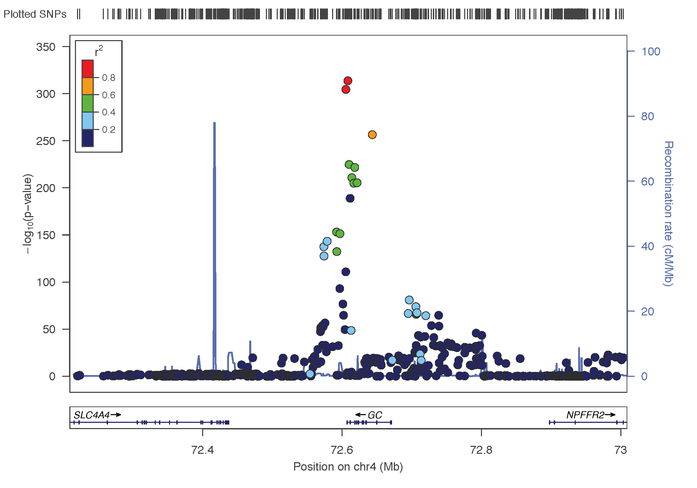
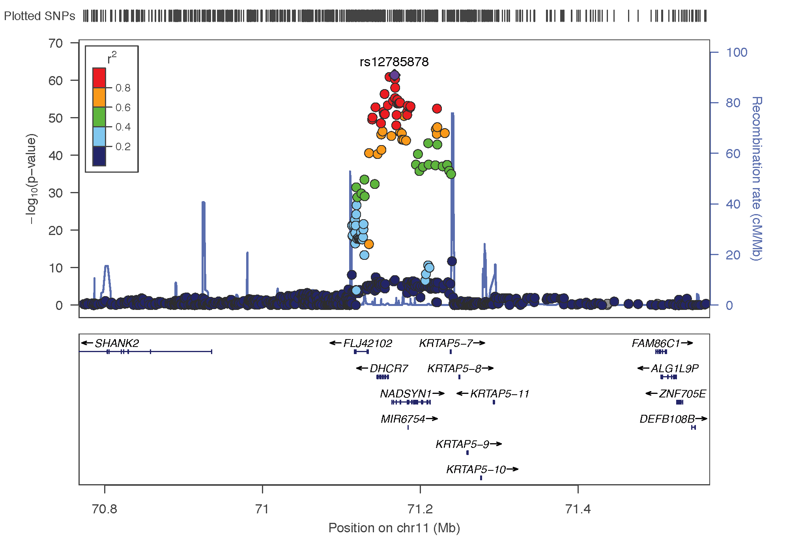
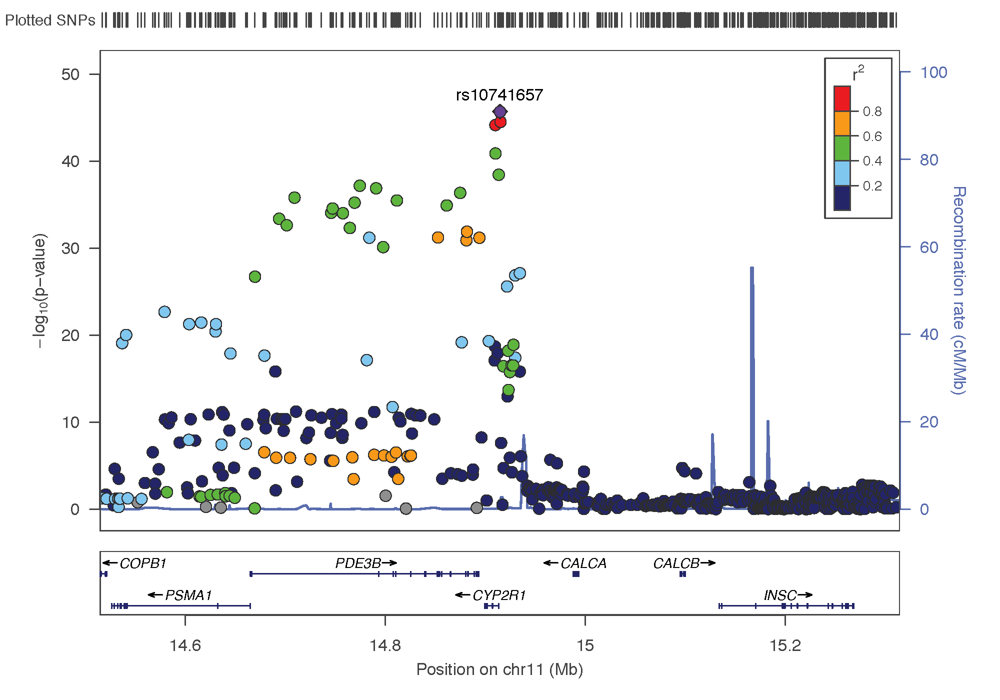
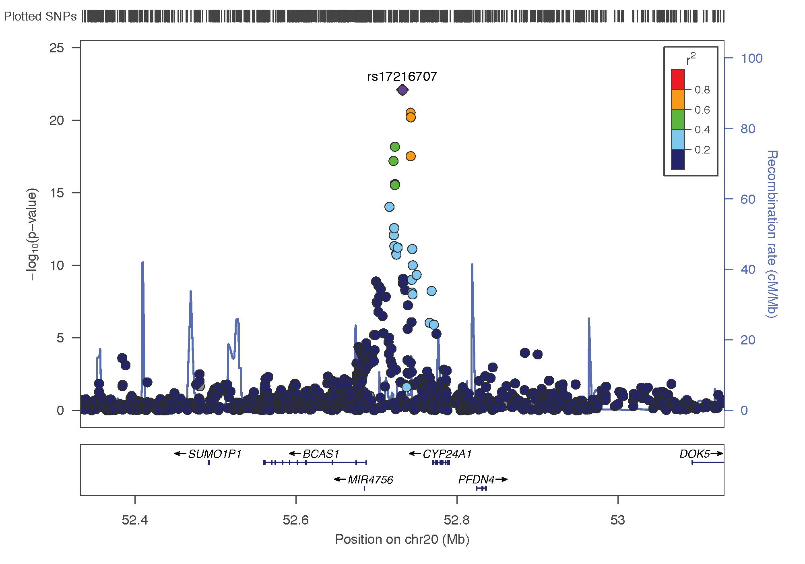
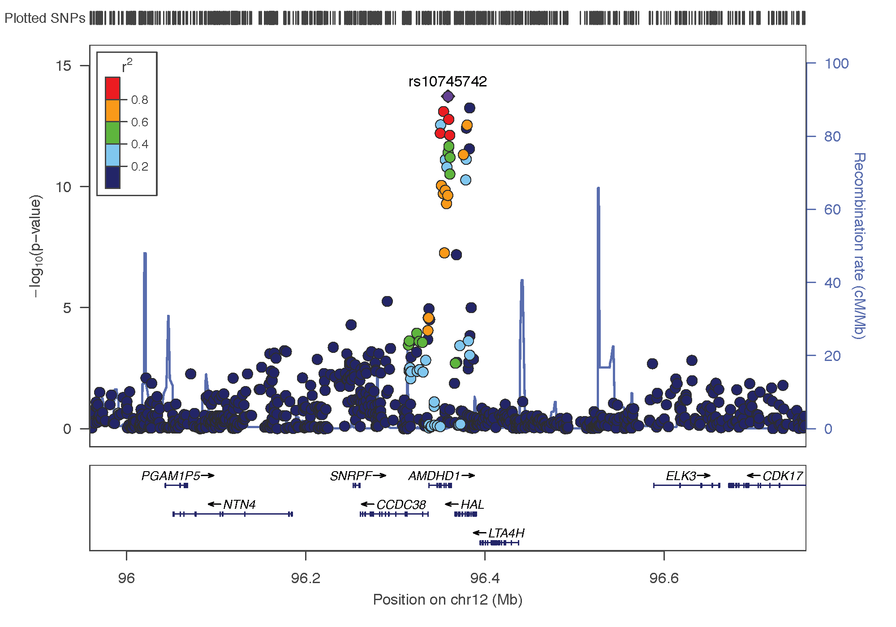
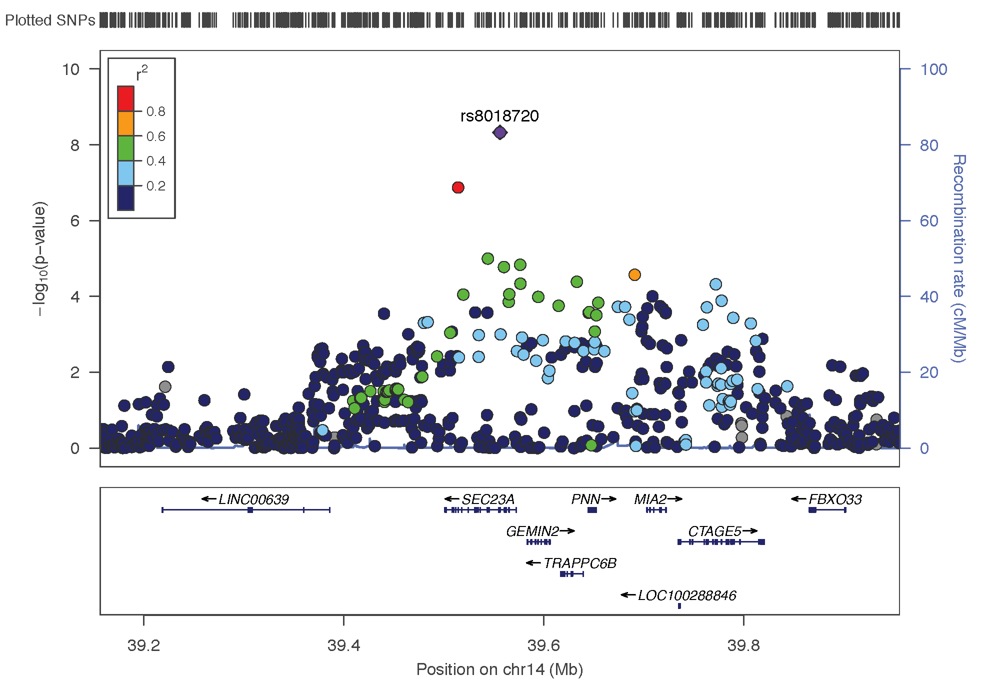

```{r echo=FALSE}
# Just to add space between the introduction of the document
knitr::asis_output(htmltools::htmlPreserve("<br><br>"))
```

> This document report the application of [SMR](http://cnsgenomics.com/software/smr/#Overview) and [GSMR]("http://cnsgenomics.com/software/gsmr/") to the vitamin D GWAS result of the [Xia et al publication](https://www.nature.com/articles/s41467-017-02662-2). Vitamin D is considered as the risk factor, and its potential implication with ~80 diseases is studied.


```{r echo=FALSE, message=FALSE, warning=FALSE}
library(tidyverse)
library(qqman)
library(readr)
library(DT)
library(ggrepel)
```


#- Data
***

To run a GSMR analysis we need:

- A risk factor GWAS summary statistics. [Xia et al.](https://www.nature.com/articles/s41467-017-02662-2) recently published a GWAS on Vitamin-D, with a sample size of about 80k people. Let's load this data, and transfer it on the delta cluster. Note that a light version of this file (with p<0.1) is available [here](https://github.com/holtzy/VitaminD-GWAS/tree/master/0_DATA)
```{bash, eval=FALSE}
# First transfert VitaminD data from Inode localy
cd /Users/y.holtz/Dropbox/QBI/4_UK_BIOBANK_GWAS_PROJECT/VitaminD-GWAS/0_DATA
scp uqyholtz@inode.qbi.uq.edu.au:/ibscratch/users/uqzzhu1/dataset/25Hydro* .

# Then from locally to delta
cd /Users/y.holtz/Dropbox/QBI/4_UK_BIOBANK_GWAS_PROJECT/VitaminD-GWAS/0_DATA
scp 25Hydro* y.holtz@delta.imb.uq.edu.au://home/y.holtz/VITAMIND_XIA_ET_AL

# good to delta folder
cd /home/y.holtz/VITAMIND_XIA_ET_AL/1_GWAS

# I miss the frequence of the major allele in this file. I can use the hapmap3 frequencies previously calculated
cat /home/y.holtz/BLOOD_GWAS/1_GWAS/all_frequency_1.freq

# --- MA FORMAT --- make the file with this new column, transform it in a format suitable for GSMR.
echo "SNP A1 A2 freq b se p n" > GWAS_vitaminD_XiaEtAL.ma
join <(zcat 25HydroxyVitaminD_QC.METAANALYSIS1.txt | sort -k 1,1) <(awk '{print $1, $3}' /home/y.holtz/BLOOD_GWAS/1_GWAS/all_frequency*.freq | sort -k 1,1) | awk '{ print $1,$2,$3,$15,$4,$5,$6,$14}' >>  GWAS_vitaminD_XiaEtAL.ma

# --- LINEAR FORMAT --- make a .linear format suitable for PLINK or FUMA
echo "CHR SNP BP A1 TEST NMISS BETA STAT P" > GWAS_vitaminD_XiaEtAL.linear
zcat 25HydroxyVitaminD_QC.METAANALYSIS1.txt.gz | grep -v 'Chr' | awk '{ print $13, $1, $12, $2, "ADD", $14, $4, $4*$5, $6}' >> GWAS_vitaminD_XiaEtAL.linear
R  # We need to remove the 10^5 format for 100000 format
data=read.table("GWAS_vitaminD_XiaEtAL.linear", header=T)
data$BP = round(data$BP, 0)
options(scipen=500)
write.table(data, file="GWAS_vitaminD_XiaEtAL.linear", quote=F, row.names=FALSE )

# --- LIGHT FORMAT --- make a light version for github
cat GWAS_vitaminD_XiaEtAL.linear | head -1 >  GWAS_vitaminD_XiaEtAL.linear.light
cat GWAS_vitaminD_XiaEtAL.linear | awk '{if( $9 < 0.1){print $0}}' >>  GWAS_vitaminD_XiaEtAL.linear.light
gzip GWAS_vitaminD_XiaEtAL.linear.light

# Transfer locally?
cd ~/Dropbox/QBI/4_UK_BIOBANK_GWAS_PROJECT/VitaminD-GWAS/0_DATA
scp y.holtz@delta.imb.uq.edu.au:/home/y.holtz/VITAMIND_XIA_ET_AL/1_GWAS/GWAS_vitaminD_XiaEtAL.linear.light.gz .

```


- GWAS summary statistics for diseases we want to explain. I'm gonna consider several sources of information:

    + 23 diseases comming from a meta-analysis of the UKBiobank and the GERA consortium. Available online [here](http://cnsgenomics.com/data.html). Diseases available are: allergic rhinitis, asthma, cancer ,card depress, dermatophytosis, dia2, dyslipid, hemorrhoids, hernia_abdominopelvic, hyper, insomnia, iron deficiency, irritable bowel, macdegen, ostioa, ostiop, peptic_ulcers, psychiatric, pvd stress, sum diseases, varicose veins). File available here on Inode: `ibscratch/users/uqzzhu1/dataset/formatted_meta/combined_ukb_gera*`
    
    + 66 other diseases already used in the [GSMR paper by Zhihong et al](https://www.nature.com/articles/s41467-017-02317-2). These include Alzheimer, depression, neuroticsm, Schizophrenia, Type II Diabete and others. File available here: `ibscratch/users/uqzzhu1/dataset/formatted_meta/`


#- Vitamin-D GWAS: description {.tabset .tabset-fade .tabset-pills}
***


##Manhattan
```{r,  message=FALSE, warning=FALSE}
# Read data
data <- read_delim("0_DATA/GWAS_vitaminD_XiaEtAL.linear.light.gz", col_names=T, delim=" ")
#data=data[ sample(seq(1,nrow(data)), 100000) , ]

# Calculate a few sumstat?
nb_snp=nrow(data)
signif = data %>% filter(P<0.00000001) %>% arrange(CHR, BP)
nb_signif=nrow(signif)
```


The GWAS has been run on **`r nb_snp` SNPs**. `r nb_signif` SNPs showed a significant association (with a 10^-8 threshold).  Here is a manhattan plot summarizing the results. The genetic determinism of VitaminD is oligogenic: controlled by a few major loci.
```{r, fig.width=9, fig.heigth=8}
manhattan(data[which(data$P<0.05) , ], chr = 'CHR', bp = 'BP', p='P', snp = 'SNP', suggestiveline = 5, genomewideline = 8, annotatePval=0.0000001, ylim=c(0,400))
```


Here is a list of all the significant assoc:
```{r}
datatable(signif, rownames = FALSE, options = list(pageLength = 5) )
```

##Loci {.tabset .tabset-fade .tabset-pills}
Let's try to summarize the associations that have been discovered. There are 6 main associations:

- **rs3755967**: chromosome 4 ~ 73Mb | gene: GC
- **rs12785878**: chromosome 11 ~ 79Mb | gene: NADSYN1 / DHCR7
- **rs10741657**: chromosome 11 ~ 15Mb | gene: CYP2R1
- **rs17216707**: chromosome 20 ~ 52Mb | gene: CYP24A1
- **rs10745742**: chromosome 12 ~ 94Mb | gene: AMDHD1
- **rs8018720**: chromosome 14 ~ 38Mb | gene: SEC23A

I can use [Locus Zoom](http://locuszoom.org/genform.php?type=yourdata) to visualise the regions of interest and see the underlying genes. Just requires the .linear result of PLINK on it, and specify the SNP of interest. Here is the result SNP per SNP:

```{r echo=FALSE}
# Just to add space between the introduction of the document
knitr::asis_output(htmltools::htmlPreserve("<br><br>"))
```

###rs3755967


###rs12785878


###rs10741657


###rs17216707


###rs10745742


###rs8018720



##Clumping
First of all I can run the plink clumping algorithm on this GWAS summary statistics to hae an insight of the unique association loci. Here are the clumping options I've used:  

- p1 is the Significance threshold for an association
- p2 is Secondary significance threshold for clumped SNPs = SNPs that are part of the association, but not pic. 
- r2 is the LD threshold for clumping and 
- clump-kb is the physical distance threshold for clumping


```{bash, eval=FALSE}
# good folder
cd /home/y.holtz/VITAMIND_XIA_ET_AL/2_CLUMPING

# Prepare command
tmp_command="plink \
          --bfile /gpfs/gpfs01/polaris/Q0286/UKBiobank/v2EURu_HM3/ukbEURu_imp_chr{TASK_ID}_v2_HM3_QC\
          --clump /home/y.holtz/VITAMIND_XIA_ET_AL/1_GWAS/GWAS_vitaminD_XiaEtAL.linear.gz \
          --clump-p1 0.00000001 --clump-p2 0.01 --clump-r2 0.50 --clump-kb 500 \
          --out /home/y.holtz/VITAMIND_XIA_ET_AL/2_CLUMPING/GWAS_vitaminD_XiaEtAL.clump"
          
# Send qsub
qsubshcom "$tmp_command" 1 150G clumping_plink 30:00:00 "-array=1-22"
```


It is more handy to have only one file with all the chromosome. Let's build it:
```{bash, eval=FALSE}
# good folder
cd /home/y.holtz/BLOOD_GWAS/2_CLUMPING

# concatenate
cat *clumped | grep "CHR" | head -1 > result_GWAS_bloodpressure_plink_clumped
cat CLUMP*clumped | grep -v "CHR" |sed '/^$/d'  >> result_GWAS_bloodpressure_plink_clumped

# Transfert it locally
cd /Users/y.holtz/Dropbox/QBI/4_UK_BIOBANK_GWAS_PROJECT/VitaminD-GWAS/0_DATA
scp  y.holtz@delta.imb.uq.edu.au:/home/y.holtz/BLOOD_GWAS/2_CLUMPING/result_GWAS_bloodpressure_plink_clumped  .
```


##FUMA
a FUMA analysis of this GWAS sumstat has been run. The result is accessible [here](http://fuma.ctglab.nl/snp2gene/9026). Password required.
```{bash, eval=FALSE}
# transfer locally for FUMA?
cd /Users/y.holtz/Desktop
scp y.holtz@delta.imb.uq.edu.au:/home/y.holtz/VITAMIND_XIA_ET_AL/1_GWAS/GWAS_vitaminD_XiaEtAL.linear.gz .
```


#- SMR {.tabset .tabset-fade .tabset-pills}
***
This GWAS result suggest an oligogenic control of the VitaminD concentration. About 5 major loci are described. We can un an SMR analysis to go deeper and find out what genes are probably involved in the control of VitaminD.

To run SMR several datasets are required:

- **bfile**: individual-level SNP genotype data. I'm gonna use the HapMap3 data set: `/gpfs/gpfs01/polaris/Q0286/UKBiobank/v2EURu_HM3/ukbEURu_imp_chr` in delta.
- **gwas-summary**: the summary statistic of the vitamin-D GWAS of Xia et al. Must be in the 'ma' format. File will be: `/home/y.holtz/VITAMIND_XIA_ET_AL/1_GWAS/GWAS_vitaminD_XiaEtAL.ma`
- **beqtl-summary**: eQTL summary data coming from [Westra et al](https://www.ncbi.nlm.nih.gov/pubmed/24013639). Downloaded from [here](http://cnsgenomics.com/software/smr/#Download). Available on delta here: /home/y.holtz/BLOOD_GWAS/5_SMR/eQTL_DATA_WESTRA`
- **out**: the output name.

Run General SMR:
```{bash, eval=FALSE}
# Good directory
cd /home/y.holtz/VITAMIND_XIA_ET_AL/5_SMR

# Run the analysis
tmp_command="smr_Linux --bfile /gpfs/gpfs01/polaris/Q0286/UKBiobank/v2EURu_HM3/ukbEURu_imp_chr{TASK_ID}_v2_HM3_QC --gwas-summary /home/y.holtz/VITAMIND_XIA_ET_AL/1_GWAS/GWAS_vitaminD_XiaEtAL.ma --beqtl-summary /home/y.holtz/BLOOD_GWAS/5_SMR/eQTL_DATA_WESTRA/westra_eqtl_hg18 --out smr_VitaminDXiaEtAl_{TASK_ID} --thread-num 1"
qsubshcom "$tmp_command" 1 30G smr_VitaminD 10:00:00 "-array=1-22"

# Concatenate chromosome results
cat smr_VitaminDXiaEtAl_*smr | head -1 > smr_VitaminDXiaEtAl.smr
cat smr_VitaminDXiaEtAl_*smr | grep -v "^probeID" >> smr_VitaminDXiaEtAl.smr

# Transfer locally
cd /Users/y.holtz/Dropbox/QBI/4_UK_BIOBANK_GWAS_PROJECT/VitaminD-GWAS/0_DATA
scp  y.holtz@delta.imb.uq.edu.au:/home/y.holtz/VITAMIND_XIA_ET_AL/5_SMR/smr_VitaminDXiaEtAl.smr  .
```


##ILMN_2131381
***
Get the data for the plot
```{bash, eval=FALSE}
# Good folder
cd /home/y.holtz/VITAMIND_XIA_ET_AL/5_SMR

# Load the position of genes:
wget https://www.cog-genomics.org/static/bin/plink/glist-hg18

# Send smr plot for this loci
tmp_command="smr_Linux --bfile /gpfs/gpfs01/polaris/Q0286/UKBiobank/v2EURu_HM3/ukbEURu_imp_chr11_v2_HM3_QC --gwas-summary /home/y.holtz/VITAMIND_XIA_ET_AL/1_GWAS/GWAS_vitaminD_XiaEtAL.ma --beqtl-summary /home/y.holtz/BLOOD_GWAS/5_SMR/eQTL_DATA_WESTRA/westra_eqtl_hg18 --out myplot --plot --probe ILMN_2131381	 --probe-wind 500 --gene-list /home/y.holtz/BLOOD_GWAS/5_SMR/glist-hg18"
qsubshcom "$tmp_command" 1 30G smr_plot_BloodPressure_loc1 10:00:00 ""

# cd /Users/y.holtz/Dropbox/QBI/4_UK_BIOBANK_GWAS_PROJECT/VitaminD-GWAS/0_DATA
cd /Users/y.holtz/Dropbox/QBI/4_UK_BIOBANK_GWAS_PROJECT/VitaminD-GWAS/0_DATA
scp  y.holtz@delta.imb.uq.edu.au:/home/y.holtz/VITAMIND_XIA_ET_AL/5_SMR/plot/myplot*  .
```

```{r, fig.align="center", fig.width=12, fig.height=9}
# Make the plot
source("SCRIPT/plot_SMR.r") 
# Read the data file in R:
SMRData = ReadSMRData("0_DATA/myplot.ILMN_2131381.txt")
# Plot the SMR results in a genomic region centred around a probe:
SMRLocusPlot(data=SMRData, smr_thresh=8.4e-6, heidi_thresh=0.05, plotWindow=1000, max_anno_probe=16)
```


##Table
```{r}
data=read.table("0_DATA/smr_VitaminDXiaEtAl.smr", header=T)
```
The general SMR result provides `r length(unique(data$probeID))` unique probes, `r length(unique(data$Gene))` unique genes and `r length(unique(data$topSNP))` SNPs spread in `r length(unique(data$ProbeChr))` chromosomes. Here an overview of the result

```{r, message=FALSE, warning=FALSE}
datatable(data, rownames = FALSE, filter="top", options = list(pageLength = 5, scrollX = "(500px") )
```

```{r echo=FALSE, warning=FALSE, message=FALSE}
# Just to add space between the introduction of the document
knitr::asis_output(htmltools::htmlPreserve("<br><br>"))
```
A few summary statistics on this table:  

##Line per K
Total number of line in the SMR output: `r nrow(data)`
```{r}
data %>%
  group_by(ProbeChr) %>%
  count() %>%
  arrange(n) %>%
  ungroup() %>%
  mutate( ProbeChr=factor(ProbeChr, ProbeChr)) %>%
  ggplot( aes(x=ProbeChr, y=n)) +
    geom_segment( aes(x=ProbeChr, xend=ProbeChr, y=0, yend=n), color="grey") +
    geom_point(size=3, color="orange") +
    coord_flip() +
    theme_bw() +
    theme( panel.grid.major.y = element_blank())
```

##Signif SMR
Total number of line in the SMR output with pSMR < 10e-8: `r data %>% filter(p_SMR<10e-8) %>% nrow() `
```{r}
data %>%
  filter(p_SMR<0.000001)
```


#- GSMR {.tabset .tabset-fade .tabset-pills}
***
The first step is to get the last GCTA version that support GSMR. Available on the QBI cluster in Zhihong folder (thanks!)
```{bash, eval=FALSE}
# First transfert localy
cd /Users/y.holtz/Desktop
scp uqyholtz@inode.qbi.uq.edu.au:/ibscratch/users/uqzzhu1/code_project/gcta/build/gcta64 .

# Then from locally to delta
cd /Users/y.holtz/Desktop
scp gcta64  y.holtz@delta.imb.uq.edu.au://home/y.holtz/bin
```


Then I have to prepare a couple of files and run the analysis
```{bash, eval=FALSE}
# Specific repo
cd /home/y.holtz/VITAMIND_XIA_ET_AL/3_GSMR

# Prepare a file that gives the location of every bfile (one per chromosome)
ls /gpfs/gpfs01/polaris/Q0286/UKBiobank/v2EURu_HM3/ukbEURu_imp_chr*_v2_HM3_QC.bed | sed 's/.bed//' > gsmr_ref_data.txt

# prepare a file that gives the link to the GWAS result for the risk factor
echo "vitaminD /home/y.holtz/VITAMIND_XIA_ET_AL/1_GWAS/GWAS_vitaminD_XiaEtAL.ma" > gsmr_exposure.txt

# prepare ONE file that list all the outcomes:
for i in $(ls /shares/compbio/Group-Wray/YanHoltz/GWAS_SUMSTAT/combined*) ; do a=$(echo $i | sed 's/.*gera_//' | sed 's/_1000g.*//') ; echo $a $i ; done > gsmr_outcome.txt
for i in $(ls /shares/compbio/Group-Wray/YanHoltz/GWAS_SUMSTAT/*txt | grep -v "combined") ; do a=$(echo $i | sed 's/.*SUMSTAT\///' | sed 's/.txt//' ) ; echo $a $i ; done  >> gsmr_outcome.txt

# Split this file: one file per outcome:
split -l 1 --numeric-suffixes gsmr_outcome.txt 
for i in x* ; do a=$(echo $i | sed 's/x0/x/') ; mv $i $a ; done

# send an array of GSMR
tmp_command="gcta64 --mbfile gsmr_ref_data.txt --gsmr-file gsmr_exposure.txt x{TASK_ID} --gsmr-alg 0 --out gsmr_result_vitaminDXiaEtAl_{TASK_ID}"
qsubshcom "$tmp_command" 1 30G GSMR_array 10:00:00 "-array=1-88"

# Once it's over, concatenate the results in a unique file
cat gsmr_result_vitaminDXiaEtAl_*gsmr | head -1 > gsmr_result_vitaminDXiaEtAl.gsmr
cat gsmr_result_vitaminDXiaEtAl_*gsmr | grep -v "Exposure" >>  gsmr_result_vitaminDXiaEtAl.gsmr
```

First I transfer the results locally for further analysis.
```{bash, eval=FALSE}
# Then from locally to delta
cd /Users/y.holtz/Dropbox/QBI/4_UK_BIOBANK_GWAS_PROJECT/VitaminD-GWAS/0_DATA
scp y.holtz@delta.imb.uq.edu.au:/home/y.holtz/VITAMIND_XIA_ET_AL/3_GSMR/gsmr_result_vitaminDXiaEtAl.gsmr .
```

Here is how the result of GSMR looks like:  

- The **exposure** is always the Vitamin-D, and we test its causality on several outcomes.   
- **Bxy** is the effect of the exposure on the disease. If this effect is positive, an increase of the exposure creates a increase in the Outcome.
- **se** is the standard error around Bxy
- **p** is the pvalue of the association test. A first approach would be to consider the test significant with a usual 0.05 threshold. However we probably need to correct for multiple testing since we run the test several times.
- **nsnp** is the number of SNP with a significant effect on the Exposure. It is not always the same because a few SNP are sometime discarded by the Heidi outlier test.

Results are displayed using 3 different ways:

```{r}
gsmr=read.table("0_DATA/gsmr_result_vitaminDXiaEtAl.gsmr", header = T)
```


##Effect size
And here is a description of the effect sizes (bxy): the effect of the risk factor on the disease:
```{r, fig.align="center", fig.height=10, fig.width=8, warning=FALSE}
gsmr %>% 
  arrange(bxy) %>%
  mutate(Outcome=factor(Outcome, Outcome)) %>%
  mutate(significance=ifelse(p<0.05, "signif", "nonSignif")) %>%
  ggplot( aes(x=Outcome, y=bxy)) +
    geom_hline( yintercept=0 ) +
    geom_segment( aes(x=Outcome, xend=Outcome, y=bxy-se, yend=bxy+se), color="skyblue", alpha=0.7) +
    geom_point(aes(color=significance), size=4) +
    scale_color_manual( values=c("grey", "orange")) +
    coord_flip() +
    theme_light() +
    theme( panel.grid.major.y = element_blank()) +
    ylab("Bxy (Effect size)") +
    xlab("")
```


##Table
```{r, message=FALSE, warning=FALSE}
datatable(gsmr %>% arrange(p), rownames = FALSE, options = list(pageLength = 5) )
```


##Pvalues
Here is an ordered barplot of the pvalues. We have several traits over the 0.05 threshold of significance, but this significance is not strong enough to pass a multiple test correction threshold.
```{r, fig.align="center", message=FALSE, warning=FALSE, fig.height=14, fig.width=8}
gsmr %>% 
  arrange(desc(p)) %>%
  mutate(Outcome=factor(Outcome, Outcome)) %>%
  mutate(significance=ifelse(p<0.05, "signif", "nonSignif")) %>%
  ggplot( aes(x=Outcome, y=-log10(p))) +
    geom_segment( aes(x=Outcome, xend=Outcome, y=-log10(p), yend=0), color="skyblue", alpha=0.7) +
    geom_point(aes(color=significance), size=4) +
    scale_color_manual( values=c("grey", "orange")) +
    coord_flip() +
    theme_light() +
    theme( panel.grid.major.y = element_blank()) +
    ylab("-log10( pvalue )") +
    xlab("") 
```


#- Conclusion
***
<style>
div.blue { background-color:#e6f0ff; border-radius: 5px; padding: 20px;}
</style>
<div class = "blue">

- GSMR analysis reveals that vitamin-D concentration has a causal effect on Hypertension and Allergic Rhinitis. The related effect size are positive, what means that having more vitamin-D increases your chance to develop these 2 diseases.. Does it make sense?  

- There is a slight link with Iron deficiency and insomnia with a negative size effect. This would make more sense: less vitamin --> more insomnia and less Iron.  

- Promising result knowing the lack of power we have here (vitamin-D GWAS run with a sample size of 80k people only). Looking forward for the UKB data.

</div>


