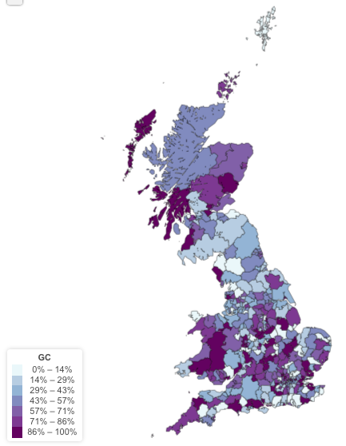

<br><br>

> This document describes how to compute Polygenic Risk Score (PRS) of the UKB sample. It also describes this PRS, and notably observe its geographical distribution.


#- Data
***
The idea is to use the effect of each SNP on the Vitamin-D as provided by [Xia et al.](https://www.nature.com/articles/s41467-017-02662-2). In order to do so we need:  

- The GWAS summary statistics of [Xia et al.](https://www.nature.com/articles/s41467-017-02662-2). Available under different format in Delta: `/shares/compbio/Group-Wray/YanHoltz/DATA/GWAS/XiaEtAl_VitaminD`  
- The genotypes of UKB participants: in delta `/afm01/Q0286/UKBiobank/v2EURu_HM3`

```{r, message=FALSE, warning=FALSE}
library(tidyverse)
```


#- Compute PRS
***
PRS are computed using the `--score` option of [plink version 1.9](https://www.cog-genomics.org/plink2). This work is made twice: first without any correction in the model, second correcting with PCs.
```{bash, eval=FALSE}
# Good folder on delta
cd /shares/compbio/Group-Wray/YanHoltz/VITAMIND_XIA_ET_AL/7_PRS

# Need upper case for Xia et al sumstat, and keep only 3 columns: SNP id, allele, beta.
more /shares/compbio/Group-Wray/YanHoltz/DATA/GWAS/XiaEtAl_VitaminD/GWAS_vitaminD_XiaEtAL.linear | awk '{ print $2,toupper($4),$7 }' | sed '1d' > tmp

# prepare command
tmp_command="~/bin/plink --bfile /gpfs/gpfs01/polaris/Q0286/UKBiobank/v2EURu_HM3/ukbEURu_imp_chr{TASK_ID}_v2_HM3_QC --score tmp --out output_PRS{TASK_ID}"

# Send command in qsub
qsubshcom "$tmp_command" 1 30G PRS_plink 10:00:00 "-array=1-22"

# Now I've got one PRS per chromosome.
# To have my final PRS, I have to multiply these PRS by the number of SNP per chromosome and sum them.

# Compute the number of SNP per chromosome:
for i in /gpfs/gpfs01/polaris/Q0286/UKBiobank/v2EURu_HM3/ukbEURu_imp_chr*_v2_HM3_QC*bim; do mylen=$(wc -l $i) ; mychr=$(echo $i | sed 's/.*chr//' | sed 's/_.*//') ; echo $mychr $mylen ; done > nbr_snp_per_chromosome

# In R I prepare my final file
R
size <- read.table("nbr_snp_per_chromosome", sep=" ")
final <- 0
for(i in seq(1,22)){
  print(i)
  chr <- 1
  data <- read.table(paste("output_PRS", chr, ".profile", sep=""), header=T)
  data$SCORE <- data$SCORE * size[ which(size$V1 == chr) , 2]
  final <- final + data$SCORE
}
output=data.frame(ID=data$FID, PRS=final)
write.table(output, file="VitaminD_PRS.txt", row.names=FALSE, quote=FALSE)
```


#- Add GPS Coordinate
***
I add the GPS coordinate of people and a few other information about them.

On Inode, I read the phenotype file and export the GPS positions:
```{r, eval=FALSE}
# good repertory
ssh uqyholtz@inode.qbi.uq.edu.au
cd /ibscratch/wrayvisscher/Yan_Holtz/0_DATA 

# Get the good column + repeat the ID + change header to respect plink format
zcat /references/UKBiobank/pheno/download/9280_12505_UKBiobank.tab.gz | awk '{print $1, $8, $144, $145, $146, $147, $148, $149}' > GPS_location.txt
gzip GPS_location.txt

# Transfer on Delta
cd ~/Desktop
scp uqyholtz@inode.qbi.uq.edu.au:/ibscratch/wrayvisscher/Yan_Holtz/0_DATA/GPS_location.txt.gz .
scp GPS_location.txt.gz y.holtz@delta.imb.uq.edu.au:/shares/compbio/Group-Wray/YanHoltz/DATA/PHENOTYPE/UKB
```

Merge both information
```{r, eval=FALSE}
cd /shares/compbio/Group-Wray/YanHoltz/VITAMIND_XIA_ET_AL/7_PRS
R
library(dplyr)
PRS <- read.table("VitaminD_PRS.txt", header=T)
GPS <- read.table("/shares/compbio/Group-Wray/YanHoltz/DATA/PHENOTYPE/UKB/GPS_location.txt.gz", header=T)

# GPS location are distributed in 3 columns. In have to summarize this info in 1 column only.
GPS$latitude <- GPS$f.129.0.0
GPS$latitude[is.na(GPS$latitude)] <- GPS$f.129.1.0[is.na(GPS$latitude)]
GPS$latitude[is.na(GPS$latitude)] <- GPS$f.129.2.0[is.na(GPS$latitude)]
GPS$longitude <- GPS$f.130.0.0
GPS$longitude[is.na(GPS$longitude)] <- GPS$f.130.1.0[is.na(GPS$longitude)]
GPS$longitude[is.na(GPS$longitude)] <- GPS$f.130.2.0[is.na(GPS$longitude)]
GPS <- GPS %>% dplyr::select(f.eid, f.31.0.0, latitude, longitude)

# Merge
data <- merge(PRS, GPS, by.x="ID", by.y="f.eid", all.x=T) %>% na.omit() %>% dplyr::select(longitude, latitude, PRS, ID, f.31.0.0)
write.table(data, file="VitaminD_PRS_with_GPS.txt", row.names=FALSE, quote=FALSE)
gzip VitaminD_PRS_with_GPS.txt
 
# Locally
cd /Users/y.holtz/Dropbox/QBI/4_UK_BIOBANK_GWAS_PROJECT/VitaminD-GWAS/0_DATA
scp y.holtz@delta.imb.uq.edu.au:/shares/compbio/Group-Wray/YanHoltz/VITAMIND_XIA_ET_AL/7_PRS/VitaminD_PRS_with_GPS.txt.gz .

```


#- Description of PRS
***
Distribution of the PRS:
```{r}
# Load the file
data <- read.table("0_DATA/VitaminD_PRS_with_GPS.txt.gz", header=T)

# Distribution?
data %>%
  mutate(sex = recode( f.31.0.0, `1`="female", `0`="male") ) %>%
  ggplot(aes(x=PRS, fill=sex)) +
      geom_histogram( bins=100) +
      facet_wrap( ~sex, ncol=1 )
```


#- Relationship between PRS and diseases {.tabset}
***

I build a file with the ICD10 code obsered in UKB people. It uses the field `main ICD10` (field 41202-0.0 to 41202-0.379) and `secondary ICD10`  (field 41204-0.0 to 41204-0.434).
```{r, eval=FALSE}
# Work done in October 2017 on Inode

# Make script extract.sh:
zcat /references/UKBiobank/pheno/download/9280_12505_UKBiobank.tab.gz | cut -f1,8,9,22-24,144-146,147-149,4069-4071,4081,4082,4066-4068,3438,3439-3441,5899-5901,5902-5943,6181,6185-6564,6593-7027,7058-7062,26-28,29-31,4075-4077,4081,5896-5898,6008-6010,6179,6180,262-264,361-363,6593-7027 > /ibscratch/wrayvisscher/Yan_Holtz/3_UKB_COMO/DATA/UKB_phenos.txt

# Send with Qsub
qsub -b y -cwd -e tmp -o tmp "/ibscratch/wrayvisscher/Yan_Holtz/3_UKB_COMO/SCRIPTS/extract.sh"

# Zip the result
gzip /ibscratch/wrayvisscher/Yan_Holtz/3_UKB_COMO/DATA/UKB_phenos.txt

# Transfer it locally
cd /Users/y.holtz/Desktop
scp uqyholtz@inode.qbi.uq.edu.au:/ibscratch/wrayvisscher/Yan_Holtz/3_UKB_COMO/DATA/UKB_phenos.txt.gz .

# Transfert on Delta
scp UKB_phenos.txt.gz y.holtz@delta.imb.uq.edu.au:/shares/compbio/Group-Wray/YanHoltz/DATA/PHENOTYPE/UKB
```

In this file, I can easily spot people who developped a disease using the ICD10 code of this disease. For example, let's get the ids of people who developped Myeloid, ICD10 code C92*. Only 570 people are concerned..
```{r, eval=FALSE}
cd /shares/compbio/Group-Wray/YanHoltz/VITAMIND_XIA_ET_AL/7_PRS/LINK_DISEASE
printf "F00\nG30\nG47\nD50\nF840" > tocheck
for i in $(cat tocheck) ; do 
  echo $i ; 
  zcat /shares/compbio/Group-Wray/YanHoltz/DATA/PHENOTYPE/UKB/UKB_phenos.txt.gz | grep $i | cut -f1 > list_$i
done
```

And a list of all ids in the UKB:
```{r, eval=FALSE}
zcat /shares/compbio/Group-Wray/YanHoltz/DATA/PHENOTYPE/UKB/UKB_phenos.txt.gz | cut -f1 > list_all
```

Make a summary file:
```{r, eval=FALSE}
# Read all ids
data <- read.table("list_all", header=TRUE)

# loop
for( i in c("F00", "G30", "G47", "D50", "F840" ) ){
  print(i)
  tmp <- read.table(paste("list_",i,sep=""), header=FALSE)
  data$new <- ifelse(data$f.eid %in% tmp$V1, 1, 0)
  colnames(data)[ which(colnames(data)=="new")] = i
}
```

Merge this info with the PRS data
```{r, eval=FALSE}
PRS <- read.table("/shares/compbio/Group-Wray/YanHoltz/VITAMIND_XIA_ET_AL/7_PRS/PRS_general/VitaminD_PRS_with_GPS.txt.gz", header=TRUE)
data <- merge(PRS, data, by.x="ID", by.y="f.eid", all.x=TRUE)

# Save file
write.table(data, file="PRS_with_diseases.txt", quote=FALSE, row.names=FALSE)

# zip it
gzip PRS_with_diseases.txt
```

Send this file locally
```{r, eval=FALSE}
# Transfer it locally
cd /Users/y.holtz/Dropbox/QBI/4_UK_BIOBANK_GWAS_PROJECT/VitaminD-GWAS/0_DATA
scp y.holtz@delta.imb.uq.edu.au:/shares/compbio/Group-Wray/YanHoltz/VITAMIND_XIA_ET_AL/7_PRS/LINK_DISEASE/PRS_with_diseases.txt.gz .
```

Visualize that:
```{r}
data <- read.table("0_DATA/PRS_with_diseases.txt.gz", header=T)

data %>% 
  dplyr::select(PRS, F00:F840) %>%
  gather(disease, value, -1) %>%
  ggplot( aes(x=as.factor(value), y=PRS, fill=as.factor(value))) +
    geom_boxplot() +
    theme(legend.position="none") +
    facet_wrap(~as.factor(disease))
```


Representation using decile: I count the number of people with a disease in each decile of Vitamin-D PRS. Looks like it work for F00 = Dementia in Alzheimer's disease. But it is in the wrong side? If I have more vitamin D (decile is high), then I have more people witht this disease? This is very weird..

```{r}
data %>%
    mutate(decile = ntile(PRS, 10)) %>%
    dplyr::select(decile, F00:F840) %>%
    gather(disease, value, -1) %>%   
    group_by(decile, disease) %>%
    summarize(nb=sum(value)) %>%
    ggplot( aes(x=decile, y=nb)) +
      geom_bar(stat="identity", width=0.4, fill="skyblue", alpha=0.9) +
      scale_x_continuous(breaks=seq(1,10)) +
      xlab("VitaminD PRS decile") +
      ylab("Number of people with Myeloid") +
      facet_wrap(~disease, scale="free_y")
```


#- Relationship between PRS and PCs {.tabset}
***

First of all I need to get the coordinate of each UKB participants on its 10 first PCs. I'm gonna get the PCs in Angli file:
```{r, eval=FALSE}
cd /shares/compbio/Group-Wray/YanHoltz/VITAMIND_XIA_ET_AL/7_PRS/LINK_PC
cp /gpfs/gpfs01/polaris/Q0286/uqaxue/phen/covar_sex_age_10PCs.txt .
```

Then I merge my PRS with this PC information
```{r, eval=FALSE}
PRS <- read.table("/shares/compbio/Group-Wray/YanHoltz/VITAMIND_XIA_ET_AL/7_PRS/PRS_general/VitaminD_PRS_with_GPS.txt.gz", header=TRUE)
PC <- read.table("covar_sex_age_10PCs.txt", header=T)

# Merge
data <- merge(PRS, PC, by.x="ID", by.y="FID", all.x=TRUE)

# Save file
write.table(data, file="PRS_with_PC.txt", quote=FALSE, row.names=FALSE)

# zip it
gzip PRS_with_PC.txt
```

Send this file locally
```{r, eval=FALSE}
# Transfer it locally
cd /Users/y.holtz/Dropbox/QBI/4_UK_BIOBANK_GWAS_PROJECT/VitaminD-GWAS/0_DATA
scp y.holtz@delta.imb.uq.edu.au:/shares/compbio/Group-Wray/YanHoltz/VITAMIND_XIA_ET_AL/7_PRS/LINK_PC/PRS_with_PC.txt.gz .
```

Check the relationship
```{r, warning=FALSE, message=FALSE, fig.width=10, fig.height=10}
data <- read.table("0_DATA/PRS_with_PC.txt.gz", header=TRUE)

data %>% head(1000) %>%
  dplyr::select(PRS, PC1:PC10) %>%
  gather(PC, value, -1) %>%
  ggplot( aes(x=PRS, y=value)) +
    stat_density_2d(aes(fill = ..density..), geom = "raster", contour = FALSE) +
    scale_fill_distiller(palette= "Spectral", direction=1) +
    scale_x_continuous(expand = c(0, 0)) +
    scale_y_continuous(expand = c(0, 0)) +
    theme(
      legend.position='none'
    ) +
    facet_wrap( ~PC) +
    ggtitle("Correlation between VitaminD PRS and the 10 first PCs") +
    theme_classic()
```

Check through a Scatterplot
```{r, warning=FALSE, message=FALSE, fig.width=10, fig.height=10}
data %>% 
  dplyr::select(PRS, PC1:PC10) %>%
  gather(PC, value, -1) %>%
  ggplot( aes(x=PRS, y=value)) +
    geom_point(size=0.1, alpha=0.1) +
    theme(
      legend.position='none'
    ) +
    facet_wrap( ~PC) +
    ggtitle("Correlation between VitaminD PRS and the 10 first PCs") 

```

Clearly something happening on PCs 1, 2 3, 4, 6


#- Geographical Distribution of PRS
***
I used the [UKB geo application](https://holtzyan.shinyapps.io/UKB_geo/) to represent the geographical distribution of the PRS. I used the place of birth has a proxy of the position of each UKB study participant.  

There is no organization of the PRS per region.


#- Geographical distribution of the GC gene
***

First I need to get the allele of the genome wide significant SNPs for all the UK Biobank participants. I've got 6 SNPs to recover as described by Xia et al.

```{r, eval=FALSE}
cd /shares/compbio/Group-Wray/YanHoltz/VITAMIND_XIA_ET_AL/7_PRS/PRS_GCgene
tmp_command="plink --bfile /gpfs/gpfs01/polaris/Q0286/UKBiobank/v2EURu_HM3/ukbEURu_imp_chr4_v2_HM3_QC --snp rs3755967 --recode --out allele_at_GC" ; qsubshcom "$tmp_command" 1 10G recover_allele 10:00:00 ""
tmp_command="plink --bfile /gpfs/gpfs01/polaris/Q0286/UKBiobank/v2EURu_HM3/ukbEURu_imp_chr11_v2_HM3_QC --snp rs12785878 --recode --out allele_at_DHCR7" ; qsubshcom "$tmp_command" 1 10G recover_allele 10:00:00 ""

# Other SNP are not in HAPMAP3
tmp_command="plink --bfile /gpfs/gpfs01/polaris/Q0286/UKBiobank/v2EURu_impQC/ukbEURu_imp_chr11_v2_imp_QC --snp rs10741657 --recode --out allele_at_CYP2R1" ; qsubshcom "$tmp_command" 1 10G recover_allele 10:00:00 ""
tmp_command="plink --bfile /gpfs/gpfs01/polaris/Q0286/UKBiobank/v2EURu_impQC/ukbEURu_imp_chr20_v2_imp_QC --snp rs17216707 --recode --out allele_at_CYP24A1" ; qsubshcom "$tmp_command" 1 10G recover_allele 10:00:00 ""
tmp_command="plink --bfile /gpfs/gpfs01/polaris/Q0286/UKBiobank/v2EURu_impQC/ukbEURu_imp_chr12_v2_imp_QC --snp rs10745742 --recode --out allele_at_AMDHD1" ; qsubshcom "$tmp_command" 1 10G recover_allele 10:00:00 ""
tmp_command="plink --bfile /gpfs/gpfs01/polaris/Q0286/UKBiobank/v2EURu_impQC/ukbEURu_imp_chr14_v2_imp_QCC --snp rs8018720 --recode --out allele_at_SEC23A" ; qsubshcom "$tmp_command" 1 10G recover_allele 10:00:00 ""
```


Then I need to merge this file with the localization of people.
```{r, eval=FALSE}
R
library(dplyr)
PRS <- read.table("allele_at_GC.ped", header=F)
GPS <- read.table("/shares/compbio/Group-Wray/YanHoltz/DATA/PHENOTYPE/UKB/GPS_location.txt.gz", header=T)

# GPS location are distributed in 3 columns. In have to summarize this info in 1 column only.
GPS$latitude <- GPS$f.129.0.0
GPS$latitude[is.na(GPS$latitude)] <- GPS$f.129.1.0[is.na(GPS$latitude)]
GPS$latitude[is.na(GPS$latitude)] <- GPS$f.129.2.0[is.na(GPS$latitude)]
GPS$longitude <- GPS$f.130.0.0
GPS$longitude[is.na(GPS$longitude)] <- GPS$f.130.1.0[is.na(GPS$longitude)]
GPS$longitude[is.na(GPS$longitude)] <- GPS$f.130.2.0[is.na(GPS$longitude)]
GPS <- GPS %>% dplyr::select(f.eid, f.31.0.0, latitude, longitude)

# Merge & clean
data <- merge(PRS, GPS, by.x="V1", by.y="f.eid", all.x=T) %>% 
  na.omit() %>%
  mutate(GC_gene=as.factor(paste(V7,V8,sep=""))) %>% 
  filter(GC_gene!="00") %>% 
  droplevels() %>% 
  mutate(GC=as.numeric(GC_gene)) %>% 
  dplyr::select(latitude, longitude, GC)
  
# Save and zip
write.table(data, file="VitaminD_PRS_geneGC.txt", row.names=FALSE, quote=FALSE)
gzip VitaminD_PRS_geneGC.txt
 
# Locally
cd /Users/y.holtz/Dropbox/QBI/4_UK_BIOBANK_GWAS_PROJECT/VitaminD-GWAS/0_DATA
scp y.holtz@delta.imb.uq.edu.au:/shares/compbio/Group-Wray/YanHoltz/VITAMIND_XIA_ET_AL/7_PRS/PRS_GCgene/VitaminD_PRS_geneGC.txt.gz .
```


Result:
<center>

</center>

**TODO**

Same with other genes  
Score of all genes together  


