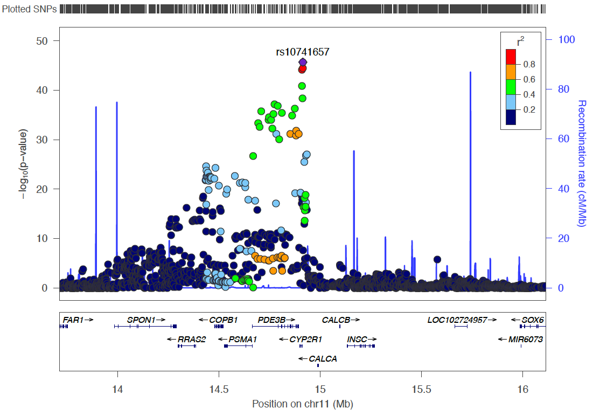

<hr>

*Yan Holtz, Zhihong Zhu, Julanne Frater, Perry Bartlett, Jian Yang, John McGrath*

<hr>


<br><br>
```{r echo=FALSE, warning=FALSE, message=FALSE}
# A few library
library(tidyverse)
library(DT)
library(hrbrthemes)
library(ggrepel)
```


#Method
***
I'm gonna use the methylation data located on Delta at `/gpfs/gpfs01/polaris/Q0286/uqywu16/omics/methy`

I run SMR on it, like I've done for eQTL data.


#DNA methylation data description {.tabset}
***
```{r, warning=FALSE}
# load data
data <- read.table("0_DATA/smr_methyl_VitaminDXiaEtAl.smr", header=T)
```

The data set is composed by **`r nrow(data)` SNP - gene methylation associations**. These association are distributed along every chromosomes:

```{r, fig.align="center"}
table(data$ProbeChr) %>%
  as.data.frame() %>%
  ggplot( aes(x=Var1, y=Freq)) +
    geom_bar(stat="identity", fill="skyblue") +
    xlab("chromosome") +
    ylab("Number of SNP / gene methylation association") +
    theme_ipsum()
```


#Run SMR
***
The first step of SMR consists to run the algorythm on every significant mQTL (mQTL = significant relationship between a SNP allele and the methylation of a gene). For each gene involved in an mQTL, we are going to test its putative effect on our trait (vitaminD) thanks to the GWAS summary statistic of this trait.

```{bash, eval=FALSE}
# Good directory
cd /shares/compbio/Group-Wray/YanHoltz/VITAMIND_XIA_ET_AL/9_METHYLATION

# Run the analysis
tmp_command="smr_Linux --bfile /gpfs/gpfs01/polaris/Q0286/UKBiobank/v2EURu_HM3/ukbEURu_imp_chr{TASK_ID}_v2_HM3_QC --gwas-summary /shares/compbio/Group-Wray/YanHoltz/VITAMIND_XIA_ET_AL/1_GWAS/GWAS_vitaminD_XiaEtAL.ma --beqtl-summary /gpfs/gpfs01/polaris/Q0286/uqywu16/omics/methy/bl_meqtl_cis_std_chr{TASK_ID} --out smr_methyl_VitaminDXiaEtAl_{TASK_ID} --thread-num 1"
qsubshcom "$tmp_command" 1 30G smr_VitaminD 10:00:00 "-array=1-22"

# Concatenate chromosome results
cat smr_methyl_V*smr | head -1 > smr_methyl_VitaminDXiaEtAl.smr
cat smr_methyl_V*smr | grep -v "^probeID" >> smr_methyl_VitaminDXiaEtAl.smr

# Transfer locally
cd /Users/y.holtz/Dropbox/QBI/4_UK_BIOBANK_GWAS_PROJECT/VitaminD-GWAS/0_DATA
scp  y.holtz@delta.imb.uq.edu.au:/shares/compbio/Group-Wray/YanHoltz/VITAMIND_XIA_ET_AL/9_METHYLATION/smr_methyl_VitaminDXiaEtAl.smr  .
```


#Result {.tabset}
***

Significant SMR results are found in 3 genetic regions. These 3 regions are also detected by the Vitamin D GWAS.  
  
Threshold used for significance: 0.05 / # of Methylation association = 0.05 / `r  nrow(data)` = `r 0.05/nrow(data)`
```{r, warning=FALSE}
# Compute signif threshold
thres <- 0.05 / nrow(data)
```

## Chromo 4 (GC)

```{r, warning=FALSE}
# Show significant association:
data %>% 
  filter(p_SMR < thres & topSNP_chr==4)
```

<br>


Can I make a diagram of these associations?

```{r, fig.width=10, fig.align="center", warning=FALSE}
tmp <- data %>%
  filter(ProbeChr==4) %>%
  filter(Probe_bp>71000000 & Probe_bp<74000000) %>%
  dplyr::select(Gene, topSNP, p_SMR, Probe_bp, topSNP_bp) %>%
  gather(key, position, -1, -2, -3) %>%
  mutate(position=position/1000000)
  
tmp %>% ggplot( aes(y=position, x=key)) +
    geom_line(aes(group=paste(Gene,topSNP), color=ifelse(p_SMR<thres,"signif","non signif"))) +
    geom_point() +
    geom_text( 
      data=subset(tmp, key=="Probe_bp") %>% dplyr::select(Gene, key, position) %>% group_by(Gene) %>% summarize(key=unique(key), position=mean(position)), 
      aes( label=Gene) , angle=45, color="grey", hjust=1, nudge_x = -0.1
    ) +
    geom_text( 
      data=subset(tmp, key=="topSNP_bp") %>% dplyr::select(topSNP, key, position) %>% group_by(topSNP) %>% summarize(key=unique(key), position=mean(position)), 
      aes( x=key, label=topSNP) , angle=45, color="grey", hjust=0, nudge_x = 0.1
    ) +
    coord_flip() +
    theme_ipsum() +
    xlab("") +
    ylab("Position (Mb)") +
    labs(color="SMR assoc with Vitamin-D")

```


## Chromo 11 ~ 14Mb (CYP2R1)
```{r}
# Show significant association:
data %>% 
  filter(p_SMR < thres & topSNP_chr==11 & topSNP_bp<40000000) %>%
  arrange(Probe_bp)
```



```{r, fig.width=10, fig.align="center", warning=FALSE}
tmp <- data %>%
  filter(ProbeChr==11) %>%
  filter(Probe_bp>14000000 & Probe_bp<15500000) %>%
  dplyr::select(Gene, topSNP, p_SMR, Probe_bp, topSNP_bp) %>%
  gather(key, position, -1, -2, -3) %>%
  mutate(position=position/1000000)
  
tmp %>% ggplot( aes(y=position, x=key)) +
    geom_line(aes(group=paste(Gene,topSNP), color=ifelse(p_SMR<thres,"signif","non signif"))) +
    geom_point() +
    geom_text( 
      data=subset(tmp, key=="Probe_bp") %>% dplyr::select(Gene, key, position) %>% group_by(Gene) %>% summarize(key=unique(key), position=mean(position)), 
      aes( label=Gene) , angle=45, color="grey", hjust=1, nudge_x = -0.1
    ) +
    geom_text( 
      data=subset(tmp, key=="topSNP_bp") %>% dplyr::select(topSNP, key, position) %>% group_by(topSNP) %>% summarize(key=unique(key), position=mean(position)), 
      aes( x=key, label=topSNP) , angle=45, color="grey", hjust=0, nudge_x = 0.1
    ) +
    coord_flip() +
    theme_ipsum() +
    xlab("") +
    ylab("Position (Mb)") +
    labs(color="SMR assoc with Vitamin-D")

```


## Chromo 11 ~ 71Mb (DHCR7)
```{r}
# Show significant association:
data %>% 
  filter(p_SMR < thres & topSNP_chr==11 & topSNP_bp>40000000) %>%
  arrange(Probe_bp)
```


```{r, fig.width=10, fig.align="center", warning=FALSE}
tmp <- data %>%
  filter(ProbeChr==11) %>%
  filter(Probe_bp>71000000 & Probe_bp<71500000) %>%
  dplyr::select(Gene, topSNP, p_SMR, Probe_bp, topSNP_bp) %>%
  gather(key, position, -1, -2, -3) %>%
  mutate(position=position/1000000)
  
tmp %>% ggplot( aes(y=position, x=key)) +
    geom_line(aes(group=paste(Gene,topSNP), color=ifelse(p_SMR<thres,"signif","non signif"))) +
    geom_point() +
    geom_text( 
      data=subset(tmp, key=="Probe_bp") %>% dplyr::select(Gene, key, position) %>% group_by(Gene) %>% summarize(key=unique(key), position=mean(position)), 
      aes( label=Gene) , angle=45, color="grey", hjust=1, nudge_x = -0.1
    ) +
    geom_text_repel( 
      data=subset(tmp, key=="topSNP_bp") %>% dplyr::select(topSNP, key, position) %>% group_by(topSNP) %>% summarize(key=unique(key), position=mean(position)), 
      aes( x=key, label=topSNP) , angle=45, color="grey", hjust=0, nudge_x = 0.1
    ) +
    coord_flip() +
    theme_ipsum() +
    xlab("") +
    ylab("Position (Mb)") +
    labs(color="SMR assoc with Vitamin-D")

```


